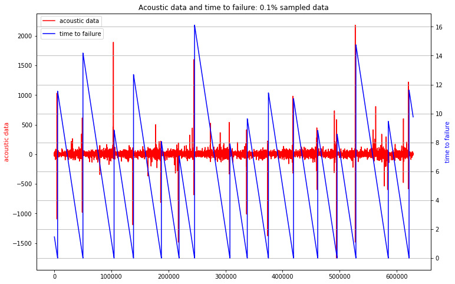
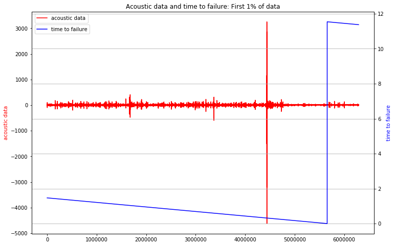
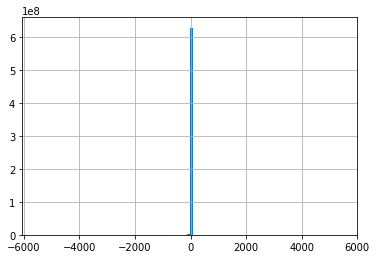
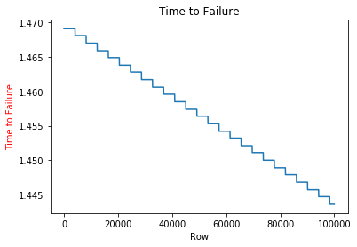
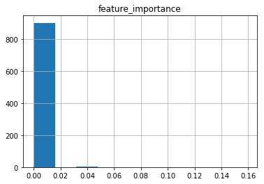
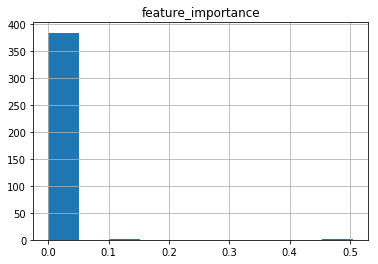
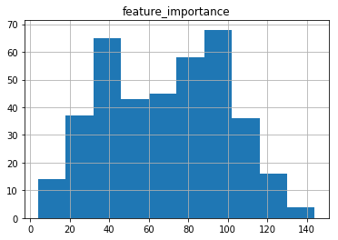
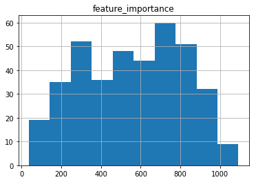
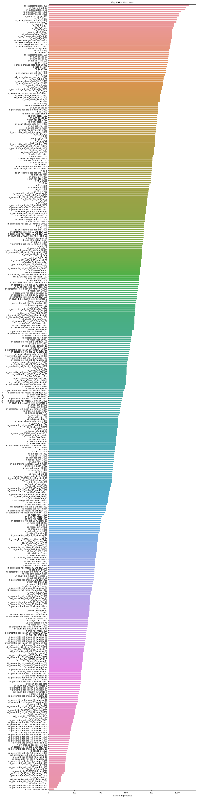

# David Braslow Module 5 Project: LANL Earthquake Prediction

# Abstract

The data for this competition come from a Kaggle competition: [LANL Earthquake Prediction](https://www.kaggle.com/c/LANL-Earthquake-Prediction). Data were collected from earthquake simulations in a laboratory setting. The competition aims to solve the following problem: is it possible to predict the timing of aperiodic earthquakes using acoustic data recorded before the earthquake? Prior work showed that the prediction of laboratory earthquakes from continuous seismic data is possible in the case of quasi-periodic laboratory seismic cycles. However, aperiodic eqarthquakes remain difficult to predict.

Under the constraints of the competition rules, I find that it is possible to use tree-based regression algorithms to improve the prediction of laboratory earthquakes using features engineered from raw acoustic data. While these models yield a substantial improvement over a dummy model, they still include a substantial amount of error. Nonetheless, these models may still be useful for further seismology research and for future development of public earthquake early-warning systems.

# Initialization

## Load packages


```python
import gc
import os
import time
import logging
import datetime
import warnings

import numpy as np
import pandas as pd

import matplotlib.pyplot as plt
import seaborn as sns

from scipy import signal, stats
from scipy.signal import butter, convolve, deconvolve, hann, hilbert
from statsmodels.robust import mad

from sklearn.metrics import mean_absolute_error
from sklearn.preprocessing import StandardScaler
from sklearn.linear_model import LinearRegression

import pywt 
from tsfresh.feature_extraction import feature_calculators

from itertools import product
from tqdm import tqdm_notebook
from joblib import Parallel, delayed

warnings.filterwarnings("ignore")
```

## Load the data


```python
#Set File Path
IS_LOCAL = True
if(IS_LOCAL):
    PATH="../dsc-5-capstone-project-online-ds-sp-000/LANL-Earthquake-Prediction"
else:
    PATH="../input/"
os.listdir(PATH)
```


```python
# Explore Test Folder
print("There are {} files in test folder".format(len(os.listdir(os.path.join(PATH, 'test' )))))
```


```python
%%time
# Load Train Data
train_df = pd.read_csv(os.path.join(PATH,'train.csv'), dtype={'acoustic_data': np.int16, 'time_to_failure': np.float32})
```


```python
print("Train: rows:{} cols:{}".format(train_df.shape[0], train_df.shape[1]))
```

    Train: rows:629145480 cols:2
    


```python
# Examine some train rows
pd.options.display.precision = 15
train_df.head()
```


<div>
<style scoped>
    .dataframe tbody tr th:only-of-type {
        vertical-align: middle;
    }

    .dataframe tbody tr th {
        vertical-align: top;
    }

    .dataframe thead th {
        text-align: right;
    }
</style>
<table border="1" class="dataframe">
  <thead>
    <tr style="text-align: right;">
      <th></th>
      <th>acoustic_data</th>
      <th>time_to_failure</th>
    </tr>
  </thead>
  <tbody>
    <tr>
      <th>0</th>
      <td>12</td>
      <td>1.469099998474121</td>
    </tr>
    <tr>
      <th>1</th>
      <td>6</td>
      <td>1.469099998474121</td>
    </tr>
    <tr>
      <th>2</th>
      <td>8</td>
      <td>1.469099998474121</td>
    </tr>
    <tr>
      <th>3</th>
      <td>5</td>
      <td>1.469099998474121</td>
    </tr>
    <tr>
      <th>4</th>
      <td>8</td>
      <td>1.469099998474121</td>
    </tr>
  </tbody>
</table>
</div>


# Scrubbing the Data

The test segments are 150,000 rows each, and I assume they are independent. I therefore split the train data into segments of the same size. I then calculate a large number of features for each segment. For demonstration purposes, I create only 1000 train samples.


```python
SEGMENT_ROWS = 150000
```

## Feature Generation


```python
def add_trend_feature(arr):
    idx = np.array(range(len(arr)))
    lr = LinearRegression()
    lr.fit(idx.reshape(-1, 1), arr)
    return lr.coef_[0]

def classic_sta_lta(x, length_sta, length_lta):
    sta = np.cumsum(x ** 2)

    # Convert to float
    sta = np.require(sta, dtype=np.float)

    # Copy for LTA
    lta = sta.copy()

    # Compute the STA and the LTA
    sta[length_sta:] = sta[length_sta:] - sta[:-length_sta]
    sta /= length_sta
    lta[length_lta:] = lta[length_lta:] - lta[:-length_lta]
    lta /= length_lta

    # Pad zeros
    sta[:length_lta - 1] = 0

    ratio = sta / lta   
    ratio = ratio[~np.isnan(ratio)]
    ratio = ratio[~np.isinf(ratio)]
    
    return ratio

def calc_change_rate(x):
    change = (np.diff(x) / x[:-1])
    change = change[~np.isnan(change)]
    change = change[~np.isinf(change)]
    return np.mean(change)

def mad(data, axis=None):
    return np.mean(np.absolute(data - np.mean(data, axis)), axis)

def denoise_signal(x, wavelet='db4', level=1):
    """
    1. Adapted from waveletSmooth function found here:
    http://connor-johnson.com/2016/01/24/using-pywavelets-to-remove-high-frequency-noise/
    2. Threshold equation and using hard mode in threshold as mentioned
    in section '3.2 denoising based on optimized singular values' from paper by Tomas Vantuch:
    http://dspace.vsb.cz/bitstream/handle/10084/133114/VAN431_FEI_P1807_1801V001_2018.pdf
    """
    
    # Decompose to get the wavelet coefficients
    coeff = pywt.wavedec(x, wavelet, mode="per")
    
    # Calculate sigma for threshold
    sigma = (1/0.6745) * mad(coeff[-level])

    # Calculate the univeral threshold
    uthresh = sigma * np.sqrt(2*np.log(len(x)))
    coeff[1:] = (pywt.threshold(i, value=uthresh, mode='hard') for i in coeff[1:])
    
    # Reconstruct the signal using the thresholded coefficients
    return pywt.waverec(coeff, wavelet, mode='per')
```


```python
class FeatureGenerator(object):
    
    def __init__(self, dtype, n_jobs=1, n_samples=1000, n_cycles = None):
        self.segment_rows = 150000
        self.dtype = dtype
        self.filename = None
        self.n_jobs = n_jobs
        self.test_files = []
        
        self.n_cycles = n_cycles
        self.len_train = 629145480
        
        
        if self.dtype == 'train':
            self.filename = PATH + '/train.csv'
            
            if self.n_cycles:
                self.n_samples = 0
                self.cycle_shift = round(self.segment_rows/self.n_cycles)
                for cycle in range(self.n_cycles):
                    cycle_samples = np.floor((self.len_train - cycle * self.cycle_shift)/self.segment_rows).astype(int)
                    self.n_samples += cycle_samples
            else:
                self.n_samples = n_samples
                
        else:
            submission = pd.read_csv(PATH + '/sample_submission.csv')
            for seg_id in submission.seg_id.values:
                self.test_files.append((seg_id, PATH + '/test/' + seg_id + '.csv'))
            self.n_samples = len(submission.seg_id.values)
    
    # Define generator to provide acoustic data chunks
    def read_chunks(self):
        if self.dtype == 'train':
#             total_rows = train_df.shape[0]
#             scaling_factor = ((total_rows - self.segment_rows) / (self.n_samples - 1))
#             seg_inds = np.round(np.array(range(0, self.n_samples)) * scaling_factor).astype(int)
            
            iterator_df = pd.read_csv(PATH + '/train.csv', skiprows = 1, iterator=True, chunksize=150000, header=None, 
                      names = ['acoustic_data', 'time_to_failure'],  dtype={'acoustic_data': np.float64, 'time_to_failure': np.float64})
            train_data_cycle = 0
    
            for counter in range(self.n_samples):
                try:
                    df = iterator_df.get_chunk()
                except:
                    train_data_cycle += 1
                    iterator_df = pd.read_csv(PATH + '/train.csv', skiprows = 1 + train_data_cycle*50000, iterator=True, chunksize=150000, header=None, 
                          names = ['acoustic_data', 'time_to_failure'],  dtype={'acoustic_data': np.float64, 'time_to_failure': np.float64})
                    df = iterator_df.get_chunk()
                                    
                x = df['acoustic_data'].values
                y = df['time_to_failure'].values[-1]
                seg_id = 'train_' + str(counter)
                del df
                yield seg_id, x, y

        else:
            for seg_id, f in self.test_files:
                df = pd.read_csv(f, dtype={'acoustic_data': np.float64})
                x = df.acoustic_data.values[-self.segment_rows:]
                del df
                yield seg_id, x, -999
    
    #Call feature function for each of 6 data transformations, collect into one dictionary
    def get_features(self, x, y, seg_id):
        """
        Gets six groups of features: from untransformed, real, and imaginary parts of FFT, from raw and denoised data.
        """
        
        # Untransformed signals - raw and denoised
        raw = x
        ur_dict = self.features(raw, 'ur')
    
        denoised = denoise_signal(x)
        ud_dict = self.features(denoised, 'ud')
        
        # FFT transformed signals - raw and denoised
        zc_raw = np.fft.fft(raw)
        realFFT_raw = np.real(zc_raw)
        imagFFT_raw = np.imag(zc_raw)
        
        rr_dict = self.features(realFFT_raw, 'rr')
        ir_dict = self.features(imagFFT_raw, 'ir')

        zc_den = np.fft.fft(denoised)
        realFFT_den = np.real(zc_den)
        imagFFT_den = np.imag(zc_den)
        
        rd_dict = self.features(realFFT_den, 'rd')
        id_dict = self.features(imagFFT_den, 'id')
        
        dict_tuples = zip(['ur', 'rr', 'ir', 'ud', 'rd', 'id'], [ur_dict, rr_dict, ir_dict, ud_dict, rd_dict, id_dict])
#        dict_tuples = zip(['ur', 'ud'], [ur_dict, ud_dict])
        main_dict = {}
        
        main_dict['seg_id'] = seg_id   
        main_dict['target'] = y        
        
        for prefix, p_dict in dict_tuples:
            for k, v in p_dict.items():
                    main_dict[f'{prefix}_{k}'] = v
                    
        return main_dict
        
    #Calculate features from data
    def features(self, x, type = None):
        feature_dict = dict()


        # lists with parameters to iterate over them
        percentiles = [5, 10, 25, 50, 75, 90]
        hann_windows = [150, 5000, 15000]
        spans = [50, 150, 500, 1500, 5000, 15000]
        slices = [1000, 3000, 10000, 30000, 50000]
        windows = [10, 30, 100, 300, 1000, 3000, 10000]
        borders = list(range(-4000, 4001, 1000))
        peaks = [10, 20, 50, 100]
        coefs = [1, 5, 10, 50, 100]
        lags = [10, 100, 1000, 10000]
        autocorr_lags = [5, 10, 30, 100, 300, 1000, 3000, 10000]
        
        # transforms of X used repeatedly
        abs_x = np.abs(x)
        x_ser = pd.Series(x)
        
        # basic summary stats
        feature_dict['mean'] = np.mean(x)
        feature_dict['std'] = np.std(x)
        feature_dict['max'] = np.max(x)
        feature_dict['min'] = np.min(x)
        feature_dict['sum'] = np.sum(x)

        # intermediate summary stats
        feature_dict['mad'] = mad(x)
        feature_dict['kurt'] = stats.kurtosis(x)
        feature_dict['skew'] = stats.skew(x)
        feature_dict['med'] = np.median(x)
        feature_dict['ave10'] = stats.trim_mean(x, 0.1)
        
        # basic stats on absolute values
        feature_dict['mean_change_abs'] = np.mean(np.diff(x))
        feature_dict['abs_max'] = np.max(abs_x)
        feature_dict['abs_mean'] = np.mean(abs_x)
        feature_dict['abs_std'] = np.std(abs_x)

        # Harmonic, Geometric and Hilbert means
        feature_dict['hmean'] = stats.hmean(abs_x[np.nonzero(abs_x)[0]])
        feature_dict['gmean'] = stats.gmean(abs_x[np.nonzero(abs_x)[0]]) 
        feature_dict['Hilbert_mean'] = np.abs(hilbert(x)).mean()
        
        # K-statistics and moments
#         for i in range(3, 5):
#             feature_dict[f'kstat_{i}'] = stats.kstat(x, i)
#             feature_dict[f'moment_{i}'] = stats.moment(x, i)

#         for i in [1, 2]:
#             feature_dict[f'kstatvar_{i}'] = stats.kstatvar(x, i)
                
        # Range stats
        feature_dict['max_to_min'] = np.max(x) / np.abs(np.min(x))
        feature_dict['max_to_min_diff'] = np.max(x) - np.abs(np.min(x))
        
        # Change rates for slices of data
        feature_dict['mean_change_rate'] = calc_change_rate(x)
        
        for slice_length, direction in product([1000, 3000, 10000, 30000], ['first', 'last']):
            if direction == 'first':
                feature_dict[f'mean_change_rate_{direction}_{slice_length}'] = calc_change_rate(x[:slice_length])
            elif direction == 'last':
                feature_dict[f'mean_change_rate_{direction}_{slice_length}'] = calc_change_rate(x[-slice_length:])

        # Percentiles on original and absolute values
        if (type != 'ur'):
            feature_dict['iqr'] = np.subtract(*np.percentile(x, [75, 25]))
            feature_dict['iqr1'] = np.subtract(*np.percentile(x, [95, 5]))
            for p in percentiles:
                feature_dict[f'percentile_{p}'] = np.percentile(x, p)
                feature_dict[f'abs_percentile_{p}'] = np.percentile(abs_x, p)
        
        # Trend features
        feature_dict['trend'] = add_trend_feature(x)
        feature_dict['abs_trend'] = add_trend_feature(abs_x)

        # STA/LTA Ratios
        feature_dict['classic_sta_lta1_mean'] = classic_sta_lta(x, 500, 10000).mean()
        feature_dict['classic_sta_lta2_mean'] = classic_sta_lta(x, 5000, 100000).mean()
        feature_dict['classic_sta_lta3_mean'] = classic_sta_lta(x, 3333, 6666).mean()
        feature_dict['classic_sta_lta4_mean'] = classic_sta_lta(x, 10000, 25000).mean()
        feature_dict['classic_sta_lta5_mean'] = classic_sta_lta(x, 50, 1000).mean()
        feature_dict['classic_sta_lta6_mean'] = classic_sta_lta(x, 100, 5000).mean()
        feature_dict['classic_sta_lta7_mean'] = classic_sta_lta(x, 333, 666).mean()
        feature_dict['classic_sta_lta8_mean'] = classic_sta_lta(x, 4000, 10000).mean()
            
        # Hann windows
        for hw in hann_windows:
            feature_dict[f'Hann_window_mean_{hw}'] = (convolve(x, hann(hw), mode='same') / sum(hann(hw))).mean()     

        # Summary statistics on various slices of data
        for agg_type, slice_length, direction in product([np.std, np.min, np.max, np.mean], slices, ['first', 'last']):
            agg_name = agg_type.__name__
            if direction == 'first':
                feature_dict[f'{agg_name}_{direction}_{slice_length}'] = agg_type(x[:slice_length])
            elif direction == 'last':
                feature_dict[f'{agg_name}_{direction}_{slice_length}'] = agg_type(x[-slice_length:])

        # Statistics on rolling windows of various sizes
        for w in windows:
            x_roll_std = x_ser.rolling(w).std().dropna().values
            x_roll_mean = x_ser.rolling(w).mean().dropna().values

            feature_dict[f'ave_roll_std_{w}'] = x_roll_std.mean()
            feature_dict[f'std_roll_std_{w}'] = x_roll_std.std()
            feature_dict[f'max_roll_std_{w}'] = x_roll_std.max()
            feature_dict[f'min_roll_std_{w}'] = x_roll_std.min()

            for p in percentiles:
                feature_dict[f'percentile_roll_std_{p}_window_{w}'] = np.percentile(x_roll_std, p)

            feature_dict[f'av_change_abs_roll_std_{w}'] = np.mean(np.diff(x_roll_std))
            feature_dict[f'av_change_rate_roll_std_{w}'] = np.mean(np.nonzero((np.diff(x_roll_std) / x_roll_std[:-1]))[0])
            feature_dict[f'abs_max_roll_std_{w}'] = np.abs(x_roll_std).max()

            feature_dict[f'ave_roll_mean_{w}'] = x_roll_mean.mean()
            feature_dict[f'std_roll_mean_{w}'] = x_roll_mean.std()
            feature_dict[f'max_roll_mean_{w}'] = x_roll_mean.max()
            feature_dict[f'min_roll_mean_{w}'] = x_roll_mean.min()

            for p in percentiles:
                feature_dict[f'percentile_roll_mean_{p}_window_{w}'] = np.percentile(x_roll_mean, p)

            feature_dict[f'av_change_abs_roll_mean_{w}'] = np.mean(np.diff(x_roll_mean))
            feature_dict[f'av_change_rate_roll_mean_{w}'] = np.mean(np.nonzero((np.diff(x_roll_mean) / x_roll_mean[:-1]))[0])
            feature_dict[f'abs_max_roll_mean_{w}'] = np.abs(x_roll_mean).max()
            
        # Exponential rolling statistics
        ewma = pd.Series.ewm
        for s in spans:
            feature_dict[f'exp_Moving_average_{s}_mean'] = (ewma(x_ser, span=s).mean(skipna=True)).mean(skipna=True)
            feature_dict[f'exp_Moving_average_{s}_std'] = (ewma(x_ser, span=s).mean(skipna=True)).std(skipna=True)
            feature_dict[f'exp_Moving_std_{s}_mean'] = (ewma(x_ser, span=s).std(skipna=True)).mean(skipna=True)
            feature_dict[f'exp_Moving_std_{s}_std'] = (ewma(x_ser, span=s).std(skipna=True)).std(skipna=True)
        
        # Counts of large amplitudes
        feature_dict['count_big'] = len(x[np.abs(x) > 500])

        for slice_length, threshold in product([50000, 100000, 150000],
                                                     [5, 10, 20, 50, 100]):
            feature_dict[f'count_big_{slice_length}_threshold_{threshold}'] = (np.abs(x[-slice_length:]) > threshold).sum()
            feature_dict[f'count_big_{slice_length}_less_threshold_{threshold}'] = (np.abs(x[-slice_length:]) < threshold).sum()
        
        # Time Series Features from tsfresh
        feature_dict['abs_energy'] = feature_calculators.abs_energy(x)
        feature_dict['abs_sum_of_changes'] = feature_calculators.absolute_sum_of_changes(x)
        feature_dict['count_above_mean'] = feature_calculators.count_above_mean(x)
        feature_dict['count_below_mean'] = feature_calculators.count_below_mean(x)
        feature_dict['mean_abs_change'] = feature_calculators.mean_abs_change(x)
        feature_dict['mean_change'] = feature_calculators.mean_change(x)
        feature_dict['var_larger_than_std_dev'] = feature_calculators.variance_larger_than_standard_deviation(x)
        feature_dict['range_minf_m4000'] = feature_calculators.range_count(x, -np.inf, -4000)
        feature_dict['range_p4000_pinf'] = feature_calculators.range_count(x, 4000, np.inf)

        for i, j in zip(borders, borders[1:]):
            feature_dict[f'range_{i}_{j}'] = feature_calculators.range_count(x, i, j)

        feature_dict['ratio_unique_values'] = feature_calculators.ratio_value_number_to_time_series_length(x)
        feature_dict['first_loc_min'] = feature_calculators.first_location_of_minimum(x)
        feature_dict['first_loc_max'] = feature_calculators.first_location_of_maximum(x)
        feature_dict['last_loc_min'] = feature_calculators.last_location_of_minimum(x)
        feature_dict['last_loc_max'] = feature_calculators.last_location_of_maximum(x)

        for lag in lags:
            feature_dict[f'time_rev_asym_stat_{lag}'] = feature_calculators.time_reversal_asymmetry_statistic(x, lag)
        for autocorr_lag in autocorr_lags:
            feature_dict[f'autocorrelation_{autocorr_lag}'] = feature_calculators.autocorrelation(x, autocorr_lag)
            feature_dict[f'c3_{autocorr_lag}'] = feature_calculators.c3(x, autocorr_lag)

        for coeff, attr in product([1, 2, 3, 4, 5], ['real', 'imag', 'angle']):
            feature_dict[f'fft_{coeff}_{attr}'] = list(feature_calculators.fft_coefficient(x, [{'coeff': coeff, 'attr': attr}]))[0][1]

        feature_dict['long_strk_above_mean'] = feature_calculators.longest_strike_above_mean(x)
        feature_dict['long_strk_below_mean'] = feature_calculators.longest_strike_below_mean(x)
        feature_dict['cid_ce_0'] = feature_calculators.cid_ce(x, 0)
        feature_dict['cid_ce_1'] = feature_calculators.cid_ce(x, 1)

        for p in percentiles:
            feature_dict[f'binned_entropy_{p}'] = feature_calculators.binned_entropy(x, p)

        feature_dict['num_crossing_0'] = feature_calculators.number_crossing_m(x, 0)

        for peak in peaks:
            feature_dict[f'num_peaks_{peak}'] = feature_calculators.number_peaks(x, peak)

        for c in coefs:
            feature_dict[f'spkt_welch_density_{c}'] = list(feature_calculators.spkt_welch_density(x, [{'coeff': c}]))[0][1]
            feature_dict[f'time_rev_asym_stat_{c}'] = feature_calculators.time_reversal_asymmetry_statistic(x, c)  

        # Return dictionary with all features   
        return feature_dict

    def generate(self):
        dict_list = []
        res = Parallel(n_jobs=self.n_jobs, backend='threading')(delayed(self.get_features)(x, y, s) for s, x, y in tqdm_notebook(self.read_chunks(), total=self.n_samples))
        for r in res:
            dict_list.append(r)

        return pd.DataFrame(dict_list).set_index('seg_id')
```


```python
training_fg = FeatureGenerator(dtype='train', n_jobs = 7, n_cycles = 3)
training_data = training_fg.generate()
gc.collect()
```


    HBox(children=(IntProgress(value=0, max=12580), HTML(value='')))


    
    


    2365


```python
test_fg = FeatureGenerator(dtype='test', n_jobs= 7)
test_data = test_fg.generate()
```


    HBox(children=(IntProgress(value=0, max=2624), HTML(value='')))


    
    


```python
print(training_data.shape)
```

    (12580, 2459)
    


```python
train_X = training_data.drop('target', axis = 1)
train_y = training_data['target']
test_X = test_data.drop('target', axis = 1)
```


```python
# Dropping columns with no variance
for col in train_X.columns:
    if train_X[col].std() == 0:
        print(col)
        train_X.drop(col, axis = 1, inplace = True)
        test_X.drop(col, axis = 1, inplace = True)
```

    id_var_larger_than_std_dev
    ir_var_larger_than_std_dev
    rd_first_loc_max
    rd_var_larger_than_std_dev
    rr_first_loc_max
    rr_var_larger_than_std_dev
    ur_var_larger_than_std_dev
    


```python
train_X.to_pickle("../dsc-5-capstone-project-online-ds-sp-000/train_X_051819_v1.pkl")
train_y.to_pickle("../dsc-5-capstone-project-online-ds-sp-000/train_y_051819_v1.pkl")
test_X.to_pickle("../dsc-5-capstone-project-online-ds-sp-000/test_X_051819_v1.pkl")
```

### Scaling the data


```python
train_X = pd.read_pickle("../dsc-5-capstone-project-online-ds-sp-000/train_X_051819_v1.pkl")
train_y = pd.read_pickle("../dsc-5-capstone-project-online-ds-sp-000/train_y_051819_v1.pkl")
test_X = pd.read_pickle("../dsc-5-capstone-project-online-ds-sp-000/test_X_051819_v1.pkl")
```


```python
# n_samples = np.floor(train_df.shape[0]/150000).astype(int)
# print(n_samples)
```


```python
# train_X = train_X.iloc[:n_samples]
# train_y = train_y.iloc[:n_samples]
# test_X = test_X.iloc[:n_samples]
```


```python
train_X.shape
```


    (12580, 2451)


```python
scaler = StandardScaler()
scaler.fit(train_X)
scaled_train_X = pd.DataFrame(scaler.transform(train_X), columns=train_X.columns)
scaled_test_X = pd.DataFrame(scaler.transform(test_X), columns=test_X.columns)
```


```python
scaled_train_X.head()
```


<div>
<style scoped>
    .dataframe tbody tr th:only-of-type {
        vertical-align: middle;
    }

    .dataframe tbody tr th {
        vertical-align: top;
    }

    .dataframe thead th {
        text-align: right;
    }
</style>
<table border="1" class="dataframe">
  <thead>
    <tr style="text-align: right;">
      <th></th>
      <th>id_Hann_window_mean_150</th>
      <th>id_Hann_window_mean_15000</th>
      <th>id_Hann_window_mean_5000</th>
      <th>id_Hilbert_mean</th>
      <th>id_abs_energy</th>
      <th>id_abs_max</th>
      <th>id_abs_max_roll_mean_10</th>
      <th>id_abs_max_roll_mean_100</th>
      <th>id_abs_max_roll_mean_1000</th>
      <th>id_abs_max_roll_mean_10000</th>
      <th>...</th>
      <th>ur_std_roll_std_3000</th>
      <th>ur_sum</th>
      <th>ur_time_rev_asym_stat_1</th>
      <th>ur_time_rev_asym_stat_10</th>
      <th>ur_time_rev_asym_stat_100</th>
      <th>ur_time_rev_asym_stat_1000</th>
      <th>ur_time_rev_asym_stat_10000</th>
      <th>ur_time_rev_asym_stat_5</th>
      <th>ur_time_rev_asym_stat_50</th>
      <th>ur_trend</th>
    </tr>
  </thead>
  <tbody>
    <tr>
      <th>0</th>
      <td>-1.868025296730343</td>
      <td>-0.307867119968957</td>
      <td>-1.031520958949976</td>
      <td>-0.181324492413729</td>
      <td>-0.081373060784764</td>
      <td>-0.036132759204261</td>
      <td>0.553692268020342</td>
      <td>0.014938926032560</td>
      <td>-0.145341919932276</td>
      <td>-0.226075897666160</td>
      <td>...</td>
      <td>-0.177976571641340</td>
      <td>1.416823061274028</td>
      <td>0.017624435864879</td>
      <td>0.023428205561757</td>
      <td>0.006884098150869</td>
      <td>0.023572085709051</td>
      <td>-0.044940716043807</td>
      <td>0.023439320799592</td>
      <td>-0.006303815574594</td>
      <td>-1.764341778974555</td>
    </tr>
    <tr>
      <th>1</th>
      <td>0.617486569483899</td>
      <td>0.137657579768559</td>
      <td>0.423120697003740</td>
      <td>0.030545671940883</td>
      <td>-0.065789691014123</td>
      <td>0.007242205534134</td>
      <td>-0.209385712143007</td>
      <td>-0.326470684526183</td>
      <td>-0.248034889296313</td>
      <td>-0.302666172633878</td>
      <td>...</td>
      <td>0.015743631027025</td>
      <td>0.802073951256828</td>
      <td>0.017502540324692</td>
      <td>0.023894373171805</td>
      <td>0.006690446946730</td>
      <td>0.023529921571459</td>
      <td>-0.045342029735137</td>
      <td>0.024339424884943</td>
      <td>-0.006167001014674</td>
      <td>0.488196132447382</td>
    </tr>
    <tr>
      <th>2</th>
      <td>1.602236594105866</td>
      <td>0.282906532545382</td>
      <td>0.876375308729919</td>
      <td>0.087123327518538</td>
      <td>-0.060858343265067</td>
      <td>0.080847498203487</td>
      <td>0.504713776746398</td>
      <td>-0.141235914918180</td>
      <td>-0.115172756672712</td>
      <td>-0.229672527152221</td>
      <td>...</td>
      <td>-0.026604641203208</td>
      <td>1.503320683608041</td>
      <td>0.017038814700234</td>
      <td>0.023027319482238</td>
      <td>0.007304888671439</td>
      <td>0.023643647090035</td>
      <td>-0.015525324829838</td>
      <td>0.022735615623125</td>
      <td>-0.006001120219182</td>
      <td>2.134532830001319</td>
    </tr>
    <tr>
      <th>3</th>
      <td>0.353103223307276</td>
      <td>0.021795943681444</td>
      <td>0.142530675739899</td>
      <td>0.048068897737055</td>
      <td>-0.061860807886322</td>
      <td>0.092463539242257</td>
      <td>-0.201858399665372</td>
      <td>-0.263662728161442</td>
      <td>-0.180071144884529</td>
      <td>-0.022663243056184</td>
      <td>...</td>
      <td>0.065227258933937</td>
      <td>1.487196201646913</td>
      <td>0.018093046399149</td>
      <td>0.023544525617562</td>
      <td>0.008272025554111</td>
      <td>0.024025844780557</td>
      <td>-0.033593707052685</td>
      <td>0.023724171814507</td>
      <td>-0.007067613716508</td>
      <td>0.880842619542917</td>
    </tr>
    <tr>
      <th>4</th>
      <td>-0.629388613984889</td>
      <td>-0.123647429803665</td>
      <td>-0.354470773712179</td>
      <td>0.120712617067539</td>
      <td>-0.056700736042159</td>
      <td>0.041584121721062</td>
      <td>0.210142227518463</td>
      <td>0.310167109146876</td>
      <td>-0.074696050817168</td>
      <td>0.045198818496467</td>
      <td>...</td>
      <td>0.099678783762354</td>
      <td>1.512353499345495</td>
      <td>0.017969401379634</td>
      <td>0.023548702530544</td>
      <td>0.007412482302284</td>
      <td>0.023219113283770</td>
      <td>-0.024351955702832</td>
      <td>0.023685935315630</td>
      <td>-0.005846588492127</td>
      <td>-0.361562632575097</td>
    </tr>
  </tbody>
</table>
<p>5 rows × 2451 columns</p>
</div>


Drop columns with no variance


```python
for col in scaled_train_X.columns:
    if scaled_train_X[col].std() == 0:
        print(col)
        scaled_train_X.drop(col, axis = 1, inplace = True)
        scaled_test_X.drop(col, axis = 1, inplace = True)
```

## Feature Selection

First, drop features with correlations above 0.99


```python
CORR_LIM = 0.99
corr_df = scaled_train_X.corr()
corr_mat = corr_df.values

col_list = scaled_train_X.columns
col_remove_list = []
for i, col in enumerate(col_list):
        
        #Get correlations for that columns
        col_corr = corr_df[col]
        
        #Remove correlation with itself
        col_corr = col_corr.drop(col, axis = 0)
        
        #Get maximum correlation with other variables
        max_corr = col_corr.max()
        min_corr = col_corr.min()
        if abs(min_corr) > max_corr:
            max_corr = abs(min_corr)
        
        #If this column has a large correlation, chose it for removal
        if max_corr > CORR_LIM:
            print(col, max_corr)
            col_remove_list.append(col)
            corr_df.drop(col, axis = 0, inplace=True)
            corr_df.drop(col, axis = 1, inplace=True)
            
print(len(col_remove_list))            
```

    id_Hilbert_mean 0.9999971756790271
    id_abs_energy 0.9999997920342152
    id_abs_max 1.0
    id_abs_max_roll_mean_10 0.9999974523357663
    id_abs_max_roll_mean_100 0.9999999978497456
    id_abs_max_roll_mean_1000 0.9999999996702449
    id_abs_max_roll_mean_10000 0.9999997553114534
    id_abs_max_roll_mean_30 0.9999998207394749
    id_abs_max_roll_mean_300 0.9999999998726445
    id_abs_max_roll_mean_3000 0.9999999801670848
    id_abs_max_roll_std_10 1.0
    id_abs_max_roll_std_100 1.0
    id_abs_max_roll_std_1000 1.0
    id_abs_max_roll_std_10000 1.0
    id_abs_max_roll_std_30 1.0
    id_abs_max_roll_std_300 1.0
    id_abs_max_roll_std_3000 1.0
    id_abs_mean 1.0
    id_abs_percentile_10 0.9926591927807127
    id_abs_percentile_25 0.9984567370296731
    id_abs_percentile_5 0.992460680537915
    id_abs_percentile_50 0.9999999995370185
    id_abs_percentile_75 0.9997464503526012
    id_abs_percentile_90 0.9999999999460351
    id_abs_std 0.9999936497114755
    id_abs_sum_of_changes 0.9999996897066276
    id_abs_trend 0.9999339717490603
    id_amax_first_1000 0.9999999999999999
    id_amax_first_10000 0.9999999990924392
    id_amax_first_3000 0.9993861993921798
    id_amax_first_30000 1.0
    id_amax_first_50000 0.9999999999999999
    id_amax_last_1000 0.9999999999999996
    id_amax_last_10000 0.9999998851288179
    id_amax_last_3000 0.9999210464941805
    id_amax_last_30000 1.0
    id_amax_last_50000 1.0
    id_amin_first_1000 0.9918355131771344
    id_amin_first_10000 0.99998194411273
    id_amin_first_3000 0.9990071993410999
    id_amin_first_30000 0.9999999626160542
    id_amin_first_50000 0.9986257216399614
    id_amin_last_1000 0.9915904085073192
    id_amin_last_10000 0.9999799782313205
    id_amin_last_3000 0.9990357156062241
    id_amin_last_30000 1.0
    id_amin_last_50000 0.9986479977639023
    id_av_change_abs_roll_mean_10 0.9981557966218936
    id_av_change_abs_roll_mean_100 0.9997660239553129
    id_av_change_abs_roll_mean_1000 0.9996996695581838
    id_av_change_abs_roll_mean_10000 0.9999511849783279
    id_av_change_abs_roll_mean_30 0.9992644949787342
    id_av_change_abs_roll_mean_300 0.9997698536988158
    id_av_change_abs_roll_mean_3000 0.9993349492924707
    id_av_change_rate_roll_mean_10 1.0000000000006042
    id_av_change_rate_roll_mean_100 1.0000000000006055
    id_av_change_rate_roll_mean_1000 1.0000000000006062
    id_av_change_rate_roll_mean_10000 1.0000000000006062
    id_av_change_rate_roll_mean_30 1.0000000000005966
    id_av_change_rate_roll_mean_300 1.0000000000006062
    id_av_change_rate_roll_mean_3000 1.0000000000006062
    id_av_change_rate_roll_std_10 1.0000000000004179
    id_av_change_rate_roll_std_100 1.0000000000005238
    id_av_change_rate_roll_std_1000 1.0000000000005635
    id_av_change_rate_roll_std_10000 1.000000000000598
    id_av_change_rate_roll_std_30 1.0000000000004972
    id_av_change_rate_roll_std_300 1.0000000000004765
    id_av_change_rate_roll_std_3000 1.0000000000004126
    id_ave_roll_mean_1000 0.9999932704210568
    id_ave_roll_mean_10000 0.9999999456007043
    id_ave_roll_mean_3000 0.9999989988436472
    id_ave_roll_std_10 0.9999819669842241
    id_ave_roll_std_100 0.99998389067647
    id_ave_roll_std_1000 0.9999831270003646
    id_ave_roll_std_10000 0.9999593316465325
    id_ave_roll_std_30 0.999982629676966
    id_ave_roll_std_300 0.9999842536308081
    id_ave_roll_std_3000 0.9999782947029593
    id_binned_entropy_10 0.9995750411661337
    id_binned_entropy_25 0.9998138055965242
    id_binned_entropy_75 0.9934017543219006
    id_cid_ce_0 0.9994977095400475
    id_classic_sta_lta1_mean 0.9957070717027717
    id_classic_sta_lta2_mean 0.9981583143683186
    id_classic_sta_lta3_mean 0.9999998256870847
    id_classic_sta_lta5_mean 0.9938223503863621
    id_classic_sta_lta6_mean 0.9986206188549386
    id_classic_sta_lta7_mean 0.9964684397388559
    id_classic_sta_lta8_mean 0.9917188645287986
    id_count_above_mean 0.9999961757721434
    id_count_below_mean 0.9999961743677701
    id_count_big 0.9996881597550991
    id_count_big_100000_less_threshold_10 0.9977064140992863
    id_count_big_100000_less_threshold_100 0.9995594960338081
    id_count_big_100000_less_threshold_20 0.9981867430383307
    id_count_big_100000_less_threshold_5 0.9969968449732698
    id_count_big_100000_less_threshold_50 0.9985548187669198
    id_count_big_100000_threshold_10 0.9939253328963269
    id_count_big_100000_threshold_100 0.9995592215454122
    id_count_big_100000_threshold_20 0.9948051508511767
    id_count_big_100000_threshold_5 0.9947170865953783
    id_count_big_100000_threshold_50 0.9981757029554894
    id_count_big_150000_less_threshold_10 0.9942145929047737
    id_count_big_150000_less_threshold_100 0.9997238713220478
    id_count_big_150000_less_threshold_20 0.9966432854294454
    id_count_big_150000_less_threshold_5 0.9942159019744264
    id_count_big_150000_less_threshold_50 0.9990329183203789
    id_count_big_150000_threshold_10 0.994277068400747
    id_count_big_150000_threshold_100 0.9997239460887497
    id_count_big_150000_threshold_20 0.9966640978356667
    id_count_big_150000_threshold_5 0.9943121065645201
    id_count_big_150000_threshold_50 0.9990349792330588
    id_count_big_50000_less_threshold_10 0.999509814550723
    id_count_big_50000_less_threshold_100 0.9999614734630333
    id_count_big_50000_less_threshold_20 0.9998448681415388
    id_count_big_50000_less_threshold_5 0.9985516757392281
    id_count_big_50000_less_threshold_50 0.9999506223563284
    id_count_big_50000_threshold_10 0.9989507597387198
    id_count_big_50000_threshold_100 0.9997547166707749
    id_count_big_50000_threshold_20 0.9994769167109727
    id_count_big_50000_threshold_5 0.9981336203015129
    id_count_big_50000_threshold_50 0.9997254093215915
    id_exp_Moving_average_15000_std 0.9922438732111922
    id_exp_Moving_average_1500_std 0.9987353021705645
    id_exp_Moving_average_150_mean 0.9955128379692494
    id_exp_Moving_average_150_std 0.9989322074826356
    id_exp_Moving_average_5000_std 0.9966954102712452
    id_exp_Moving_average_500_std 0.9990247861167664
    id_exp_Moving_average_50_std 0.998856829280146
    id_exp_Moving_std_15000_mean 0.9999000738169399
    id_exp_Moving_std_15000_std 0.9999685568831354
    id_exp_Moving_std_1500_mean 0.9999547900790218
    id_exp_Moving_std_1500_std 0.9999960743966241
    id_exp_Moving_std_150_mean 0.9999601953234475
    id_exp_Moving_std_150_std 0.9999547113225172
    id_exp_Moving_std_5000_mean 0.9998132752442022
    id_exp_Moving_std_5000_std 0.9999851442932949
    id_exp_Moving_std_500_mean 0.9999554893007376
    id_exp_Moving_std_500_std 0.9999883440579873
    id_exp_Moving_std_50_mean 0.9999760983673719
    id_exp_Moving_std_50_std 0.9999538288683466
    id_first_loc_max 1.0
    id_first_loc_min 0.9999999999999611
    id_gmean 0.9994716409636658
    id_iqr 1.0000000000000002
    id_iqr1 0.9999999999999999
    id_last_loc_max 0.999999999999828
    id_long_strk_above_mean 0.999999922953574
    id_mad 0.9999784302834344
    id_max 1.0
    id_max_roll_mean_10 0.9999939482579059
    id_max_roll_mean_100 0.9999999956510978
    id_max_roll_mean_1000 0.9999999992835545
    id_max_roll_mean_10000 0.9999993599736798
    id_max_roll_mean_30 0.9999995612786132
    id_max_roll_mean_300 0.9999999997009595
    id_max_roll_mean_3000 0.9999999310443304
    id_max_roll_std_10 0.999678963877233
    id_max_roll_std_100 0.9998880963290124
    id_max_roll_std_1000 0.9998995625149538
    id_max_roll_std_10000 0.9999855158538661
    id_max_roll_std_30 0.9998381367322154
    id_max_roll_std_300 0.9998921420743704
    id_max_roll_std_3000 0.9999137890142096
    id_mean 0.9999997815042838
    id_mean_abs_change 0.9999707252646876
    id_mean_change 1.0
    id_mean_change_abs 0.9999592594423578
    id_mean_first_1000 0.9987995507889494
    id_mean_first_10000 0.9998046928030258
    id_mean_first_3000 0.9973361459939908
    id_mean_first_30000 0.9999999519087529
    id_mean_first_50000 0.9999999896071213
    id_mean_last_30000 0.9981694534190725
    id_mean_last_50000 0.9904741484973565
    id_med 1.0
    id_min 0.9986629052566783
    id_min_roll_mean_10 0.9983942227186363
    id_min_roll_mean_100 0.9987531773016013
    id_min_roll_mean_1000 0.998730545844989
    id_min_roll_mean_10000 0.9933367116304035
    id_min_roll_mean_30 0.9984742430689942
    id_min_roll_mean_300 0.9985102993875207
    id_min_roll_mean_3000 0.9983667386252838
    id_min_roll_std_100 0.9987430801324955
    id_min_roll_std_1000 0.9999485391464477
    id_min_roll_std_10000 0.9999616008987535
    id_min_roll_std_30 0.9925494383026782
    id_min_roll_std_300 0.9998167227778602
    id_min_roll_std_3000 0.999973236357991
    id_num_crossing_0 0.998873934334378
    id_num_peaks_10 0.9973600843704029
    id_num_peaks_20 0.9923904085665716
    id_percentile_10 0.9999999999999999
    id_percentile_25 0.9999999999999992
    id_percentile_5 0.9999144070715659
    id_percentile_75 0.9998823329969718
    id_percentile_90 0.9994727492696838
    id_percentile_roll_mean_10_window_10 0.9999999514930398
    id_percentile_roll_mean_10_window_100 0.9999999897881675
    id_percentile_roll_mean_10_window_1000 0.9999999970147022
    id_percentile_roll_mean_10_window_10000 0.9999999842027488
    id_percentile_roll_mean_10_window_30 0.999999981531963
    id_percentile_roll_mean_10_window_300 0.9999999772639545
    id_percentile_roll_mean_10_window_3000 0.9999999958591023
    id_percentile_roll_mean_25_window_10 0.9999999910711601
    id_percentile_roll_mean_25_window_100 0.9999999944566657
    id_percentile_roll_mean_25_window_1000 0.9999999971463794
    id_percentile_roll_mean_25_window_10000 0.9999999978086315
    id_percentile_roll_mean_25_window_30 0.9999999936303561
    id_percentile_roll_mean_25_window_300 0.999999995876268
    id_percentile_roll_mean_25_window_3000 0.9999999973606011
    id_percentile_roll_mean_5_window_10 0.9990285424630401
    id_percentile_roll_mean_5_window_100 0.9947873826484993
    id_percentile_roll_mean_5_window_1000 0.9903994605414405
    id_percentile_roll_mean_5_window_30 0.9978956908103587
    id_percentile_roll_mean_5_window_300 0.9934821797385412
    id_percentile_roll_mean_90_window_10 0.9964711106709536
    id_percentile_roll_mean_90_window_30 0.9921238412663663
    id_percentile_roll_std_10_window_10 0.9998555295256897
    id_percentile_roll_std_10_window_100 0.9997823060172512
    id_percentile_roll_std_10_window_1000 0.9998110238443884
    id_percentile_roll_std_10_window_10000 0.9998164464936441
    id_percentile_roll_std_10_window_30 0.999812013193433
    id_percentile_roll_std_10_window_300 0.9998016860280682
    id_percentile_roll_std_10_window_3000 0.9997847572946401
    id_percentile_roll_std_25_window_10 0.999863268552801
    id_percentile_roll_std_25_window_100 0.9996492787488381
    id_percentile_roll_std_25_window_1000 0.9993756457470188
    id_percentile_roll_std_25_window_10000 0.9998084323401543
    id_percentile_roll_std_25_window_30 0.9997856758660775
    id_percentile_roll_std_25_window_300 0.9994924610667851
    id_percentile_roll_std_25_window_3000 0.9996323631966594
    id_percentile_roll_std_50_window_10 0.9998795521011111
    id_percentile_roll_std_50_window_100 0.9997062719551083
    id_percentile_roll_std_50_window_1000 0.9995415048044584
    id_percentile_roll_std_50_window_10000 0.9995390674624293
    id_percentile_roll_std_50_window_30 0.9998065464659547
    id_percentile_roll_std_50_window_300 0.9996173511631153
    id_percentile_roll_std_50_window_3000 0.9995833005349143
    id_percentile_roll_std_5_window_10 0.9999672748096716
    id_percentile_roll_std_5_window_100 0.9999838404137265
    id_percentile_roll_std_5_window_1000 0.9999950536109433
    id_percentile_roll_std_5_window_10000 0.9999625817865149
    id_percentile_roll_std_5_window_30 0.9999739051648613
    id_percentile_roll_std_5_window_300 0.9999890955288657
    id_percentile_roll_std_5_window_3000 0.9999837919103992
    id_percentile_roll_std_75_window_10 0.9997667527105784
    id_percentile_roll_std_75_window_100 0.9996142460770168
    id_percentile_roll_std_75_window_1000 0.9993878168907533
    id_percentile_roll_std_75_window_10000 0.9997698386248601
    id_percentile_roll_std_75_window_30 0.9996872997400853
    id_percentile_roll_std_75_window_300 0.9994621879100029
    id_percentile_roll_std_75_window_3000 0.9994415188044944
    id_percentile_roll_std_90_window_10 0.9998805825878478
    id_percentile_roll_std_90_window_100 0.9998820520883044
    id_percentile_roll_std_90_window_1000 0.9999261998936753
    id_percentile_roll_std_90_window_10000 0.999892750596687
    id_percentile_roll_std_90_window_30 0.9998319984719709
    id_percentile_roll_std_90_window_300 0.9998892068058292
    id_percentile_roll_std_90_window_3000 0.9999449582063944
    id_range_-1000_0 0.9999996606834549
    id_range_-2000_-1000 1.0
    id_range_-3000_-2000 1.0
    id_range_-4000_-3000 1.0
    id_range_0_1000 0.9909323570094819
    id_range_minf_m4000 1.0
    id_range_p4000_pinf 0.9993317031619376
    id_spkt_welch_density_1 0.9999999340931978
    id_spkt_welch_density_10 0.9999999232431888
    id_spkt_welch_density_100 0.9999997655369683
    id_spkt_welch_density_5 0.9999957254757608
    id_spkt_welch_density_50 0.9999996911731662
    id_std 0.9999999783479796
    id_std_first_1000 0.9999998198776888
    id_std_first_10000 0.9999999841775401
    id_std_first_3000 0.9999989393424369
    id_std_first_30000 1.000000000000003
    id_std_first_50000 1.0000000000000016
    id_std_last_1000 0.9991863183708949
    id_std_last_10000 0.9999669627217002
    id_std_last_3000 0.9999065660772822
    id_std_last_30000 0.9999999582213188
    id_std_last_50000 0.9999920810883112
    id_std_roll_mean_10 0.9993039626510376
    id_std_roll_mean_100 0.9997266130860165
    id_std_roll_mean_1000 0.9989206824874481
    id_std_roll_mean_30 0.9996569114997154
    id_std_roll_mean_300 0.9995394941176982
    id_std_roll_mean_3000 0.9970596408711428
    id_std_roll_std_10 0.999935864682294
    id_std_roll_std_100 0.999960141628651
    id_std_roll_std_1000 0.9999659464866865
    id_std_roll_std_10000 0.9999518854586325
    id_std_roll_std_30 0.9999510651115976
    id_std_roll_std_300 0.999965087783555
    id_std_roll_std_3000 0.9999659091734566
    id_time_rev_asym_stat_1 0.9999185198265136
    id_time_rev_asym_stat_10 0.9998198741165655
    id_time_rev_asym_stat_100 0.9989774775847424
    id_time_rev_asym_stat_1000 0.9999547629711476
    id_time_rev_asym_stat_10000 0.9944445503655602
    id_time_rev_asym_stat_5 0.999841554543455
    id_time_rev_asym_stat_50 0.9998993178637456
    ir_Hilbert_mean 0.9999971259465361
    ir_abs_energy 0.999996263636235
    ir_abs_max 1.0
    ir_abs_max_roll_mean_10 0.9999982095704936
    ir_abs_max_roll_mean_100 0.9999999633942359
    ir_abs_max_roll_mean_1000 0.9999999983884676
    ir_abs_max_roll_mean_10000 0.9999997942410213
    ir_abs_max_roll_mean_30 0.999999612428373
    ir_abs_max_roll_mean_300 0.9999999915031241
    ir_abs_max_roll_mean_3000 0.9999999901721311
    ir_abs_max_roll_std_10 1.0
    ir_abs_max_roll_std_100 1.0
    ir_abs_max_roll_std_1000 1.0
    ir_abs_max_roll_std_10000 1.0
    ir_abs_max_roll_std_30 1.0
    ir_abs_max_roll_std_300 1.0
    ir_abs_max_roll_std_3000 1.0
    ir_abs_mean 1.0
    ir_abs_percentile_50 0.9999999813635765
    ir_abs_percentile_75 0.998893126322087
    ir_abs_percentile_90 0.9999999999335175
    ir_abs_std 0.9999858598843346
    ir_abs_sum_of_changes 0.9999958776656809
    ir_abs_trend 0.9991547645485337
    ir_amax_first_1000 1.0
    ir_amax_first_10000 0.9999999905954021
    ir_amax_first_3000 0.9994422076186039
    ir_amax_first_30000 1.0
    ir_amax_first_50000 1.0
    ir_amax_last_1000 0.9999995111775418
    ir_amax_last_10000 0.9999999518327116
    ir_amax_last_3000 0.9999192754799748
    ir_amax_last_30000 1.0000000000000002
    ir_amax_last_50000 0.9999999999999999
    ir_amin_first_10000 0.9999802890283928
    ir_amin_first_30000 0.9999999987290433
    ir_amin_first_50000 0.996956825218242
    ir_amin_last_10000 0.9999755791914203
    ir_amin_last_30000 1.0
    ir_amin_last_50000 0.9968348949514708
    ir_av_change_abs_roll_mean_10 0.9976127207275641
    ir_av_change_abs_roll_mean_100 0.9997747897237005
    ir_av_change_abs_roll_mean_1000 0.9998974548403883
    ir_av_change_abs_roll_mean_10000 0.99995224466791
    ir_av_change_abs_roll_mean_30 0.9990012226923963
    ir_av_change_abs_roll_mean_300 0.9998800985901397
    ir_av_change_abs_roll_mean_3000 0.9994752876038967
    ir_av_change_rate_roll_mean_10 1.0000000000006062
    ir_av_change_rate_roll_mean_100 1.0000000000006062
    ir_av_change_rate_roll_mean_1000 1.0000000000006062
    ir_av_change_rate_roll_mean_10000 1.0000000000006062
    ir_av_change_rate_roll_mean_30 1.0000000000006062
    ir_av_change_rate_roll_mean_300 1.0000000000006062
    ir_av_change_rate_roll_mean_3000 1.0000000000006062
    ir_av_change_rate_roll_std_10 1.0000000000002434
    ir_av_change_rate_roll_std_100 1.0000000000001796
    ir_av_change_rate_roll_std_1000 1.0000000000006062
    ir_av_change_rate_roll_std_10000 1.0000000000006062
    ir_av_change_rate_roll_std_30 1.0000000000004505
    ir_av_change_rate_roll_std_300 1.0000000000005689
    ir_av_change_rate_roll_std_3000 1.0000000000006062
    ir_ave_roll_mean_1000 0.9999895906373356
    ir_ave_roll_mean_10000 0.9999929634356092
    ir_ave_roll_mean_3000 0.999981384653671
    ir_ave_roll_std_10 0.9999733673918502
    ir_ave_roll_std_100 0.9999760579738842
    ir_ave_roll_std_1000 0.9999757535447488
    ir_ave_roll_std_10000 0.999943875501512
    ir_ave_roll_std_30 0.9999743452445395
    ir_ave_roll_std_300 0.9999768216296986
    ir_ave_roll_std_3000 0.9999699270366529
    ir_binned_entropy_10 0.9987663558941728
    ir_binned_entropy_25 0.9988296357106947
    ir_binned_entropy_75 0.9945691172044059
    ir_cid_ce_0 0.9991925521726046
    ir_classic_sta_lta1_mean 0.9993269383152763
    ir_classic_sta_lta2_mean 0.9996060715825976
    ir_classic_sta_lta3_mean 0.9999994549144062
    ir_classic_sta_lta4_mean 0.9993064862272651
    ir_classic_sta_lta5_mean 0.9915412868306366
    ir_classic_sta_lta6_mean 0.9939441431587313
    ir_classic_sta_lta7_mean 0.9999703572473324
    ir_classic_sta_lta8_mean 0.9989735226533859
    ir_count_above_mean 0.9999987845770483
    ir_count_below_mean 0.9999987809263761
    ir_count_big_100000_threshold_10 0.9982633792816916
    ir_count_big_100000_threshold_100 0.9927509758169973
    ir_count_big_100000_threshold_20 0.997464339884831
    ir_count_big_100000_threshold_5 0.9986672469512675
    ir_count_big_100000_threshold_50 0.9952566283367841
    ir_count_big_150000_threshold_10 0.9986794626642321
    ir_count_big_150000_threshold_20 0.9941854060603477
    ir_count_big_150000_threshold_5 0.9987018872428939
    ir_exp_Moving_average_1500_std 0.9911577694381085
    ir_exp_Moving_average_150_std 0.996670380340214
    ir_exp_Moving_average_500_std 0.9963038977177509
    ir_exp_Moving_std_15000_mean 0.9999134967550015
    ir_exp_Moving_std_15000_std 0.999966650031394
    ir_exp_Moving_std_1500_mean 0.9999495568119522
    ir_exp_Moving_std_1500_std 0.9999955055590639
    ir_exp_Moving_std_150_mean 0.9999516996778286
    ir_exp_Moving_std_150_std 0.9999386159106611
    ir_exp_Moving_std_5000_mean 0.9998268454612129
    ir_exp_Moving_std_5000_std 0.9999868306122568
    ir_exp_Moving_std_500_mean 0.9999461859083504
    ir_exp_Moving_std_500_std 0.9999885029578193
    ir_exp_Moving_std_50_mean 0.9999679705410952
    ir_exp_Moving_std_50_std 0.9997901280172367
    ir_first_loc_max 1.0
    ir_first_loc_min 0.9999999999999624
    ir_gmean 0.9989065261630377
    ir_iqr 1.0000000000000009
    ir_iqr1 0.9999999999999999
    ir_last_loc_max 0.9999999999998251
    ir_long_strk_above_mean 0.9999988825540188
    ir_mad 0.9999708310842995
    ir_max 1.0
    ir_max_roll_mean_10 0.9999958694131886
    ir_max_roll_mean_100 0.9999999177169967
    ir_max_roll_mean_1000 0.9999999966194311
    ir_max_roll_mean_10000 0.9999995255250745
    ir_max_roll_mean_30 0.9999991691084567
    ir_max_roll_mean_300 0.999999981840839
    ir_max_roll_mean_3000 0.999999966059951
    ir_max_roll_std_10 0.9945751829839516
    ir_max_roll_std_100 0.9945951121735505
    ir_max_roll_std_1000 0.9970954192841174
    ir_max_roll_std_10000 0.9999703070138792
    ir_max_roll_std_3000 0.9970768860945146
    ir_mean 0.999995201346075
    ir_mean_abs_change 0.9999593870921718
    ir_mean_change 1.0
    ir_mean_change_abs 0.999959277193636
    ir_mean_first_1000 0.9995898127848367
    ir_mean_first_10000 0.9998089164407418
    ir_mean_first_3000 0.9979073833032343
    ir_mean_first_30000 0.9999990434188257
    ir_mean_first_50000 0.9999995412146977
    ir_mean_last_30000 0.9933523633166451
    ir_med 1.0
    ir_min 0.9933113861028081
    ir_min_roll_mean_10 0.9920255325545857
    ir_min_roll_mean_1000 0.9924279278401656
    ir_min_roll_mean_3000 0.9931120236824997
    ir_percentile_10 1.0
    ir_percentile_25 0.9999999999999996
    ir_percentile_5 0.999905655868454
    ir_percentile_75 0.9908906887588076
    ir_percentile_90 0.9992782528794839
    ir_percentile_roll_mean_10_window_10 0.9999999051098121
    ir_percentile_roll_mean_10_window_100 0.9999999894719214
    ir_percentile_roll_mean_10_window_1000 0.9999999945686464
    ir_percentile_roll_mean_10_window_10000 0.9999999884685138
    ir_percentile_roll_mean_10_window_30 0.9999999716610822
    ir_percentile_roll_mean_10_window_300 0.9999999941787594
    ir_percentile_roll_mean_10_window_3000 0.9999999909917663
    ir_percentile_roll_mean_25_window_10 0.9999996202708972
    ir_percentile_roll_mean_25_window_100 0.9999997611156447
    ir_percentile_roll_mean_25_window_1000 0.9999999695674187
    ir_percentile_roll_mean_25_window_10000 0.9999999936293033
    ir_percentile_roll_mean_25_window_30 0.9999996750124311
    ir_percentile_roll_mean_25_window_300 0.9999998903902582
    ir_percentile_roll_mean_25_window_3000 0.9999999895678011
    ir_percentile_roll_mean_5_window_10 0.9990145833349547
    ir_percentile_roll_mean_5_window_100 0.9943165959814926
    ir_percentile_roll_mean_5_window_30 0.9977243329525121
    ir_percentile_roll_mean_90_window_10 0.9950150903015167
    ir_percentile_roll_std_75_window_10 0.9991205146527516
    ir_percentile_roll_std_75_window_100 0.9984352233018794
    ir_percentile_roll_std_75_window_1000 0.9968358910644732
    ir_percentile_roll_std_75_window_10000 0.9974152038956994
    ir_percentile_roll_std_75_window_30 0.9988833726581373
    ir_percentile_roll_std_75_window_300 0.997906073456663
    ir_percentile_roll_std_75_window_3000 0.9947050855366497
    ir_percentile_roll_std_90_window_10 0.9998759120343104
    ir_percentile_roll_std_90_window_100 0.9998528411397303
    ir_percentile_roll_std_90_window_1000 0.9999129125399128
    ir_percentile_roll_std_90_window_10000 0.9998783399533873
    ir_percentile_roll_std_90_window_30 0.9998166754953991
    ir_percentile_roll_std_90_window_300 0.9998659200841704
    ir_percentile_roll_std_90_window_3000 0.9999382181732334
    ir_range_-1000_0 0.99999984139652
    ir_range_-2000_-1000 0.999999999531426
    ir_range_-3000_-2000 1.0
    ir_range_-4000_-3000 1.0
    ir_range_minf_m4000 1.0
    ir_range_p4000_pinf 0.9992417270280702
    ir_spkt_welch_density_1 0.9999933393075496
    ir_spkt_welch_density_10 0.9999990769564726
    ir_spkt_welch_density_100 0.9999923948000174
    ir_spkt_welch_density_5 0.9998776030842816
    ir_spkt_welch_density_50 0.9999923504777048
    ir_std 0.9999944955435481
    ir_std_first_1000 0.9999997822588685
    ir_std_first_10000 0.9999999829119096
    ir_std_first_3000 0.9999989658011104
    ir_std_first_30000 0.9999999999982575
    ir_std_first_50000 0.9999999999994295
    ir_std_last_1000 0.998429979451018
    ir_std_last_10000 0.9999616656556478
    ir_std_last_3000 0.9999230029624839
    ir_std_last_30000 0.9999830439260228
    ir_std_last_50000 0.9999850692511026
    ir_std_roll_mean_10 0.9997386082864216
    ir_std_roll_mean_100 0.9996001806716763
    ir_std_roll_mean_1000 0.9982042445496389
    ir_std_roll_mean_30 0.9997475011853341
    ir_std_roll_mean_300 0.9992041964726537
    ir_std_roll_mean_3000 0.9952501251031788
    ir_std_roll_std_10 0.9998295055975045
    ir_std_roll_std_100 0.9999535894453248
    ir_std_roll_std_1000 0.999964804578194
    ir_std_roll_std_10000 0.9999454557173637
    ir_std_roll_std_30 0.9999458565930444
    ir_std_roll_std_300 0.9999581045725457
    ir_std_roll_std_3000 0.9999599026039746
    rd_Hann_window_mean_150 0.9997659557453564
    rd_Hann_window_mean_15000 0.997411899270299
    rd_Hann_window_mean_5000 0.9994193210868466
    rd_Hilbert_mean 0.9999954859503172
    rd_abs_energy 0.9999997875518695
    rd_abs_max 1.0000000000000004
    rd_abs_max_roll_mean_10 0.9996252427956067
    rd_abs_max_roll_mean_100 0.9983574068364248
    rd_abs_max_roll_mean_1000 0.9987711144597309
    rd_abs_max_roll_mean_10000 0.9911739484965116
    rd_abs_max_roll_mean_30 0.9989036921271602
    rd_abs_max_roll_mean_300 0.9985250133405489
    rd_abs_max_roll_mean_3000 0.997708952900398
    rd_abs_max_roll_std_10 1.0
    rd_abs_max_roll_std_100 1.0
    rd_abs_max_roll_std_1000 1.0
    rd_abs_max_roll_std_10000 1.0
    rd_abs_max_roll_std_30 1.0
    rd_abs_max_roll_std_300 1.0
    rd_abs_max_roll_std_3000 1.0
    rd_abs_mean 0.9999997910121424
    rd_abs_percentile_10 0.9912396125856052
    rd_abs_percentile_50 0.9998697019405479
    rd_abs_percentile_90 0.9999990182850772
    rd_abs_std 0.9999769039965996
    rd_abs_sum_of_changes 0.9999996740899386
    rd_abs_trend 0.999963158794958
    rd_amax_first_1000 1.0000000000000004
    rd_amax_first_10000 1.0000000000000004
    rd_amax_first_3000 1.0000000000000004
    rd_amax_first_30000 1.0000000000000004
    rd_amax_first_50000 1.0000000000000004
    rd_amax_last_1000 0.9908517437602011
    rd_amax_last_10000 0.9999818314905783
    rd_amax_last_3000 0.9989911239751557
    rd_amax_last_30000 0.998639951279995
    rd_amax_last_50000 0.998644146746554
    rd_amin_first_1000 1.0
    rd_amin_first_10000 0.9999998995512914
    rd_amin_first_3000 0.9999593215024649
    rd_amin_first_30000 1.0000000000000002
    rd_amin_first_50000 1.0000000000000002
    rd_amin_last_1000 0.9905963654763161
    rd_amin_last_10000 0.9999866606348278
    rd_amin_last_3000 0.9990091709855632
    rd_amin_last_30000 1.0
    rd_amin_last_50000 1.0
    rd_autocorrelation_10 0.9988675865944904
    rd_autocorrelation_100 0.9990020569371765
    rd_autocorrelation_1000 0.9968007750808737
    rd_autocorrelation_30 0.9988151796740654
    rd_autocorrelation_300 0.9986972565472281
    rd_autocorrelation_3000 0.9955712775182
    rd_autocorrelation_5 0.9989294755010122
    rd_av_change_abs_roll_mean_10 0.9991775357617443
    rd_av_change_abs_roll_mean_100 0.9996016543711064
    rd_av_change_abs_roll_mean_1000 0.9997910698362087
    rd_av_change_abs_roll_mean_10000 0.9990229629703564
    rd_av_change_abs_roll_mean_30 0.9991991517394193
    rd_av_change_abs_roll_mean_300 0.9997670481550035
    rd_av_change_abs_roll_mean_3000 0.9995500848863351
    rd_av_change_abs_roll_std_10 0.9997050224354563
    rd_av_change_abs_roll_std_100 0.9995221994850327
    rd_av_change_abs_roll_std_1000 0.9989305764102964
    rd_av_change_abs_roll_std_10000 0.9990138190256063
    rd_av_change_abs_roll_std_30 0.9996447993722569
    rd_av_change_abs_roll_std_300 0.999313087907881
    rd_av_change_abs_roll_std_3000 0.9970784319114274
    rd_av_change_rate_roll_mean_10 1.0000000000005973
    rd_av_change_rate_roll_mean_100 1.0000000000005884
    rd_av_change_rate_roll_mean_1000 1.000000000000597
    rd_av_change_rate_roll_mean_10000 1.0000000000006062
    rd_av_change_rate_roll_mean_30 1.0000000000005984
    rd_av_change_rate_roll_mean_300 1.0000000000005982
    rd_av_change_rate_roll_mean_3000 1.0000000000006062
    rd_av_change_rate_roll_std_10 0.9999999999772272
    rd_av_change_rate_roll_std_100 1.0000000000001474
    rd_av_change_rate_roll_std_1000 1.0000000000004607
    rd_av_change_rate_roll_std_10000 1.0000000000001552
    rd_av_change_rate_roll_std_30 0.9999999999997767
    rd_av_change_rate_roll_std_300 0.9999999999889236
    rd_av_change_rate_roll_std_3000 1.0000000000004547
    rd_ave_roll_mean_10 0.9999322254782659
    rd_ave_roll_mean_100 0.9999269329341851
    rd_ave_roll_mean_1000 0.9983901228300857
    rd_ave_roll_mean_30 0.999668273743963
    rd_ave_roll_mean_300 0.9981498230945033
    rd_ave_roll_std_10 0.9989416004413485
    rd_ave_roll_std_100 0.9998356032873581
    rd_ave_roll_std_1000 0.9998957106415904
    rd_ave_roll_std_10000 0.9997336385358374
    rd_ave_roll_std_30 0.9991239628264422
    rd_ave_roll_std_300 0.9999270015294881
    rd_ave_roll_std_3000 0.9995584548292312
    rd_binned_entropy_10 0.9904681661157195
    rd_binned_entropy_5 0.9933187518768076
    rd_c3_10 0.9998766495869079
    rd_c3_100 0.9991427138728152
    rd_c3_1000 0.9984606387277306
    rd_c3_30 0.9998065607030743
    rd_c3_300 0.9993552746467613
    rd_c3_3000 0.9991017766582918
    rd_c3_5 0.9998561338343795
    rd_cid_ce_0 0.9999458626614979
    rd_cid_ce_1 0.9958887135210323
    rd_classic_sta_lta3_mean 0.9999999996861285
    rd_count_big_100000_less_threshold_10 0.9977411514259443
    rd_count_big_100000_less_threshold_100 0.997892105196043
    rd_count_big_100000_less_threshold_20 0.998214889801403
    rd_count_big_100000_less_threshold_5 0.9970370233029018
    rd_count_big_100000_less_threshold_50 0.998566127779601
    rd_count_big_100000_threshold_10 0.9939425046374176
    rd_count_big_100000_threshold_100 0.993180095001973
    rd_count_big_100000_threshold_20 0.9939370211477868
    rd_count_big_100000_threshold_5 0.9947673558047136
    rd_count_big_100000_threshold_50 0.9951728100425858
    rd_count_big_150000_less_threshold_10 0.9936225271764575
    rd_count_big_150000_less_threshold_100 0.9969504624442043
    rd_count_big_150000_less_threshold_20 0.9958250091971008
    rd_count_big_150000_less_threshold_5 0.9906666048293471
    rd_count_big_150000_less_threshold_50 0.9974226090607176
    rd_count_big_50000_less_threshold_10 0.9995101023586128
    rd_count_big_50000_less_threshold_100 0.9999614825941291
    rd_count_big_50000_less_threshold_20 0.9998448969673569
    rd_count_big_50000_less_threshold_5 0.9985503694065071
    rd_count_big_50000_less_threshold_50 0.9999506491295322
    rd_exp_Moving_average_15000_std 0.9998850083302694
    rd_exp_Moving_average_1500_mean 0.9987562628302873
    rd_exp_Moving_average_1500_std 0.9999015449060031
    rd_exp_Moving_average_150_mean 0.9988034999261203
    rd_exp_Moving_average_150_std 0.9999625030279671
    rd_exp_Moving_average_5000_mean 0.9939575000992561
    rd_exp_Moving_average_5000_std 0.999887903367757
    rd_exp_Moving_average_500_mean 0.9946850177875116
    rd_exp_Moving_average_500_std 0.9999285238293063
    rd_exp_Moving_average_50_mean 0.9905726770101119
    rd_exp_Moving_average_50_std 0.9999830713759461
    rd_exp_Moving_std_15000_mean 0.9997591956118792
    rd_exp_Moving_std_15000_std 0.9999957832380992
    rd_exp_Moving_std_1500_mean 0.9998786922949173
    rd_exp_Moving_std_1500_std 0.9999901548750371
    rd_exp_Moving_std_150_mean 0.999768401806349
    rd_exp_Moving_std_150_std 0.9999859352636056
    rd_exp_Moving_std_5000_mean 0.9996160430865205
    rd_exp_Moving_std_5000_std 0.9999933938574108
    rd_exp_Moving_std_500_mean 0.9997388046645879
    rd_exp_Moving_std_500_std 0.9999881115489228
    rd_exp_Moving_std_50_mean 0.9989653755487746
    rd_exp_Moving_std_50_std 0.9999834401051946
    rd_iqr 0.9956901411877277
    rd_iqr1 0.9999283333048722
    rd_kurt 0.9972839517162797
    rd_last_loc_max 1.0
    rd_mad 0.9993413249958024
    rd_max 1.0000000000000004
    rd_max_roll_mean_10 0.9988573368265606
    rd_max_roll_mean_100 0.9982139986297364
    rd_max_roll_mean_1000 0.9987075241956441
    rd_max_roll_mean_30 0.9981338752636875
    rd_max_roll_mean_300 0.9980625624347509
    rd_max_roll_mean_3000 0.997235505835414
    rd_max_roll_std_10 0.9999416539235721
    rd_max_roll_std_100 0.9999952890908306
    rd_max_roll_std_1000 0.9999984324469369
    rd_max_roll_std_10000 0.9999939543458889
    rd_max_roll_std_30 0.9999819271080419
    rd_max_roll_std_300 0.9999978586546214
    rd_max_roll_std_3000 0.9999983091723801
    rd_max_to_min_diff 0.9994717151196286
    rd_mean 0.9999862270521038
    rd_mean_abs_change 0.9989926223265915
    rd_mean_change 1.0
    rd_mean_change_abs 0.9999995378363313
    rd_mean_change_rate_first_10000 0.9993086994578193
    rd_mean_change_rate_first_3000 0.9911985681882906
    rd_mean_change_rate_last_10000 0.9985560629110035
    rd_mean_first_10000 0.9959768144342904
    rd_mean_first_3000 0.991262548217409
    rd_mean_first_30000 0.9934782844982525
    rd_mean_first_50000 0.994366258445871
    rd_med 1.0
    rd_min 0.9986133208193175
    rd_min_roll_mean_10 0.9981926355331266
    rd_min_roll_mean_100 0.9979456344548578
    rd_min_roll_mean_1000 0.99717720076221
    rd_min_roll_mean_10000 0.990067306770206
    rd_min_roll_mean_30 0.9979269457232232
    rd_min_roll_mean_300 0.9978112666977741
    rd_min_roll_mean_3000 0.9977675994868638
    rd_min_roll_std_1000 0.9977612659224259
    rd_min_roll_std_10000 0.9996016940356249
    rd_min_roll_std_3000 0.9980851019126775
    rd_percentile_10 0.9982319052319896
    rd_percentile_25 0.9901948313453991
    rd_percentile_5 0.9983857304992404
    rd_percentile_roll_mean_50_window_10 0.9948120365595052
    rd_percentile_roll_mean_50_window_100 0.9975374849940559
    rd_percentile_roll_mean_50_window_1000 0.9960154007980547
    rd_percentile_roll_mean_50_window_30 0.9921624906337442
    rd_percentile_roll_mean_5_window_10 0.9946054317259827
    rd_percentile_roll_mean_5_window_100 0.9927470954208849
    rd_percentile_roll_mean_5_window_1000 0.9943239945657137
    rd_percentile_roll_mean_5_window_30 0.9931249302441445
    rd_percentile_roll_mean_5_window_300 0.9929425898265438
    rd_percentile_roll_std_10_window_10 0.99348396355605
    rd_percentile_roll_std_10_window_100 0.9988789830637314
    rd_percentile_roll_std_10_window_1000 0.9986434858185516
    rd_percentile_roll_std_10_window_30 0.9949991390754923
    rd_percentile_roll_std_10_window_300 0.9944214431397557
    rd_percentile_roll_std_25_window_10 0.9961185445748028
    rd_percentile_roll_std_25_window_100 0.9991863386842669
    rd_percentile_roll_std_25_window_1000 0.9987338487689917
    rd_percentile_roll_std_25_window_10000 0.9957748505281969
    rd_percentile_roll_std_25_window_30 0.9970519298610406
    rd_percentile_roll_std_25_window_300 0.9940684750568732
    rd_percentile_roll_std_50_window_10 0.9964085897033741
    rd_percentile_roll_std_50_window_100 0.9992968331104711
    rd_percentile_roll_std_50_window_1000 0.9987601022545831
    rd_percentile_roll_std_50_window_30 0.9975318486548321
    rd_percentile_roll_std_50_window_300 0.9964012243950813
    rd_percentile_roll_std_5_window_10 0.9923123403996897
    rd_percentile_roll_std_5_window_100 0.9983575390015679
    rd_percentile_roll_std_5_window_1000 0.9997302953050595
    rd_percentile_roll_std_5_window_10000 0.9920877178863033
    rd_percentile_roll_std_5_window_30 0.991037836837931
    rd_percentile_roll_std_5_window_300 0.9992627410403123
    rd_percentile_roll_std_75_window_10 0.9976825171118491
    rd_percentile_roll_std_75_window_100 0.998156680667279
    rd_percentile_roll_std_75_window_1000 0.996809796797591
    rd_percentile_roll_std_75_window_10000 0.9932563690975609
    rd_percentile_roll_std_75_window_30 0.9942860143384243
    rd_percentile_roll_std_75_window_300 0.9937237991215582
    rd_percentile_roll_std_90_window_10 0.9992416751254048
    rd_percentile_roll_std_90_window_100 0.9995525052852963
    rd_percentile_roll_std_90_window_1000 0.9997732921069042
    rd_percentile_roll_std_90_window_10000 0.9998553912599848
    rd_percentile_roll_std_90_window_30 0.9993808782989911
    rd_percentile_roll_std_90_window_300 0.9996550796615116
    rd_percentile_roll_std_90_window_3000 0.9998698005150758
    rd_range_minf_m4000 0.9991384548168455
    rd_range_p4000_pinf 0.9991423439204068
    rd_skew 0.9977356478898584
    rd_spkt_welch_density_1 0.999999929678567
    rd_spkt_welch_density_10 0.9999999226884764
    rd_spkt_welch_density_100 0.9999997250535037
    rd_spkt_welch_density_5 0.9999956544617346
    rd_spkt_welch_density_50 0.9999996839548045
    rd_std 0.9999807347166257
    rd_std_first_1000 0.9999711753656693
    rd_std_first_10000 0.9999937533186252
    rd_std_first_3000 0.9999984033511479
    rd_std_first_30000 0.9999999700930639
    rd_std_first_50000 0.9999943479054021
    rd_std_last_1000 0.9992345387698176
    rd_std_last_10000 0.9999423248047369
    rd_std_last_3000 0.9997062306070642
    rd_std_last_30000 0.9999967301651618
    rd_std_last_50000 0.9999916346566173
    rd_std_roll_mean_10 0.999535089037288
    rd_std_roll_mean_100 0.9986876303889579
    rd_std_roll_mean_1000 0.9982305042162869
    rd_std_roll_mean_30 0.9990402791731786
    rd_std_roll_mean_300 0.9985435557519418
    rd_std_roll_mean_3000 0.997343792334387
    rd_std_roll_std_10 0.99995322386043
    rd_std_roll_std_100 0.9999563472662265
    rd_std_roll_std_1000 0.9999643930407348
    rd_std_roll_std_10000 0.9999261423578646
    rd_std_roll_std_30 0.9999556701624169
    rd_std_roll_std_300 0.9999546611041937
    rd_std_roll_std_3000 0.9999495192227805
    rd_time_rev_asym_stat_1 0.9990234876581098
    rd_time_rev_asym_stat_5 0.9937797128498802
    rd_trend 0.9999638353501159
    rr_Hann_window_mean_150 0.9998375785197287
    rr_Hann_window_mean_15000 0.9977321474778159
    rr_Hann_window_mean_5000 0.9995072362610626
    rr_Hilbert_mean 0.9999963272619412
    rr_abs_energy 0.9999962443273777
    rr_abs_max 1.0
    rr_abs_max_roll_mean_10 0.9996192569334866
    rr_abs_max_roll_mean_100 0.994061946388802
    rr_abs_max_roll_mean_1000 0.9921088364048022
    rr_abs_max_roll_mean_30 0.9988032205911174
    rr_abs_max_roll_std_10 1.0
    rr_abs_max_roll_std_100 1.0
    rr_abs_max_roll_std_1000 1.0
    rr_abs_max_roll_std_10000 1.0
    rr_abs_max_roll_std_30 1.0
    rr_abs_max_roll_std_300 1.0
    rr_abs_max_roll_std_3000 1.0
    rr_abs_mean 0.9999999955781009
    rr_abs_percentile_50 0.999927106443741
    rr_abs_percentile_90 0.9999985937857524
    rr_abs_std 0.9999490147842308
    rr_abs_sum_of_changes 0.9999958306540236
    rr_abs_trend 0.9998360244589477
    rr_amax_first_1000 1.0
    rr_amax_first_10000 1.0
    rr_amax_first_3000 1.0
    rr_amax_first_30000 1.0
    rr_amax_first_50000 1.0
    rr_amax_last_10000 0.9999705381551032
    rr_amax_last_30000 0.9980868561114931
    rr_amax_last_50000 0.9900709670737444
    rr_amin_first_1000 0.9999999999999999
    rr_amin_first_10000 0.9999998675963427
    rr_amin_first_3000 0.9999631080083905
    rr_amin_first_30000 1.0000000000000002
    rr_amin_first_50000 1.0000000000000002
    rr_amin_last_10000 0.999974419537721
    rr_amin_last_30000 1.0000000000000002
    rr_amin_last_50000 1.0000000000000002
    rr_av_change_abs_roll_mean_10 0.9978013194961263
    rr_av_change_abs_roll_mean_100 0.9992149554806875
    rr_av_change_abs_roll_mean_1000 0.9989984756181569
    rr_av_change_abs_roll_mean_30 0.9979708329311618
    rr_av_change_abs_roll_mean_300 0.9993751460087081
    rr_av_change_abs_roll_std_10 0.9955932696241506
    rr_av_change_abs_roll_std_100 0.9915591464602959
    rr_av_change_abs_roll_std_30 0.9945287650226633
    rr_av_change_rate_roll_mean_10 1.000000000000188
    rr_av_change_rate_roll_mean_100 1.0000000000003697
    rr_av_change_rate_roll_mean_1000 1.0000000000002818
    rr_av_change_rate_roll_mean_10000 1.000000000000282
    rr_av_change_rate_roll_mean_30 1.0000000000003006
    rr_av_change_rate_roll_mean_300 1.000000000000311
    rr_av_change_rate_roll_mean_3000 1.0000000000002816
    rr_av_change_rate_roll_std_10 1.0000000000002824
    rr_av_change_rate_roll_std_100 0.9999999999999786
    rr_av_change_rate_roll_std_1000 1.0000000000000007
    rr_av_change_rate_roll_std_10000 1.000000000000481
    rr_av_change_rate_roll_std_30 1.0000000000004812
    rr_av_change_rate_roll_std_300 1.0000000000000016
    rr_av_change_rate_roll_std_3000 0.9999999999999999
    rr_ave_roll_mean_10 0.9999402929036586
    rr_ave_roll_mean_100 0.9999095106439694
    rr_ave_roll_mean_1000 0.9985736351948539
    rr_ave_roll_mean_30 0.9996058422584523
    rr_ave_roll_mean_300 0.998605099577982
    rr_ave_roll_std_10 0.9987278703067756
    rr_ave_roll_std_100 0.9998282282724023
    rr_ave_roll_std_1000 0.999891044765188
    rr_ave_roll_std_10000 0.9995671725062922
    rr_ave_roll_std_30 0.9990816744538783
    rr_ave_roll_std_300 0.999924217381732
    rr_ave_roll_std_3000 0.9995279974490572
    rr_cid_ce_0 0.9983339966621182
    rr_classic_sta_lta3_mean 0.9999991386519297
    rr_classic_sta_lta7_mean 0.9999958937998138
    rr_count_big_100000_threshold_10 0.9982454097903215
    rr_count_big_100000_threshold_100 0.9927390427086316
    rr_count_big_100000_threshold_20 0.9974683153100892
    rr_count_big_100000_threshold_5 0.9986623291510749
    rr_count_big_100000_threshold_50 0.9951648487286758
    rr_count_big_150000_threshold_10 0.9986632437483118
    rr_count_big_150000_threshold_20 0.994027671660392
    rr_count_big_150000_threshold_5 0.9986962450676937
    rr_exp_Moving_average_15000_std 0.9973051983508232
    rr_exp_Moving_average_1500_mean 0.9991048807361196
    rr_exp_Moving_average_150_mean 0.999182445529585
    rr_exp_Moving_average_5000_mean 0.9956420403538896
    rr_exp_Moving_average_500_mean 0.9963295622660774
    rr_exp_Moving_average_50_mean 0.9937086544123498
    rr_exp_Moving_std_15000_mean 0.9996007035826291
    rr_exp_Moving_std_15000_std 0.9995564548620544
    rr_exp_Moving_std_1500_mean 0.9998874977622554
    rr_exp_Moving_std_1500_std 0.9997934233789921
    rr_exp_Moving_std_150_mean 0.999764454809533
    rr_exp_Moving_std_150_std 0.999585912962324
    rr_exp_Moving_std_5000_mean 0.9993704594008713
    rr_exp_Moving_std_5000_std 0.9990902399353002
    rr_exp_Moving_std_500_mean 0.9997271224331888
    rr_exp_Moving_std_500_std 0.9977754950057108
    rr_exp_Moving_std_50_mean 0.9985530852430773
    rr_exp_Moving_std_50_std 0.9975005010093386
    rr_iqr1 0.9999359857887837
    rr_kurt 0.9957802242614392
    rr_last_loc_max 0.9995589880470214
    rr_mad 0.9992696663216847
    rr_max 1.0
    rr_max_roll_std_1000 0.9954667437782753
    rr_max_roll_std_10000 0.9999476843058958
    rr_mean 0.9999926294297541
    rr_mean_change 1.0
    rr_mean_first_10000 0.9964215824456559
    rr_mean_first_3000 0.9918593086171626
    rr_mean_first_30000 0.9945877769881784
    rr_mean_first_50000 0.995641921415878
    rr_med 1.0
    rr_percentile_10 0.9978186920424
    rr_percentile_5 0.996093307667926
    rr_percentile_roll_std_75_window_10 0.994871601539301
    rr_percentile_roll_std_75_window_100 0.9974911663785421
    rr_percentile_roll_std_75_window_1000 0.9967545094026065
    rr_percentile_roll_std_75_window_30 0.9913801292198493
    rr_percentile_roll_std_75_window_300 0.9942443616091343
    rr_percentile_roll_std_90_window_10 0.9952945248591516
    rr_percentile_roll_std_90_window_100 0.9984881308447094
    rr_percentile_roll_std_90_window_1000 0.998662754610097
    rr_percentile_roll_std_90_window_10000 0.997696444886231
    rr_percentile_roll_std_90_window_30 0.9945956156725584
    rr_percentile_roll_std_90_window_300 0.9952607879758295
    rr_percentile_roll_std_90_window_3000 0.9952910752651032
    rr_range_minf_m4000 0.9986793447933554
    rr_std 0.9994242078883979
    rr_std_first_10000 0.9998910392133845
    rr_std_first_30000 0.9999995215763926
    rr_std_first_50000 0.9960661399561538
    rr_std_last_10000 0.9999002911029354
    rr_std_last_3000 0.9963379850966133
    rr_std_last_30000 0.9999808025272102
    rr_std_last_50000 0.9999863689386944
    rr_std_roll_mean_1000 0.9931028620882582
    rr_std_roll_std_10 0.9964472272518312
    rr_std_roll_std_100 0.9995853838046843
    rr_std_roll_std_1000 0.9999646345718765
    rr_std_roll_std_10000 0.9994961659401888
    rr_std_roll_std_30 0.9980122733189037
    rr_std_roll_std_300 0.999833536757952
    rr_std_roll_std_3000 0.9999037511796842
    rr_time_rev_asym_stat_1 0.9935050493571633
    rr_time_rev_asym_stat_5 0.9938635224572001
    ud_Hann_window_mean_150 0.9999998101056395
    ud_Hann_window_mean_15000 0.9999788104712595
    ud_Hann_window_mean_5000 0.9999967880014884
    ud_Hilbert_mean 0.9995236723846013
    ud_abs_energy 0.9999998227869966
    ud_abs_max 0.9999618419489429
    ud_abs_max_roll_mean_10 0.9999926008880253
    ud_abs_max_roll_mean_100 0.9998767744169393
    ud_abs_max_roll_mean_1000 1.0
    ud_abs_max_roll_mean_10000 1.0
    ud_abs_max_roll_mean_30 0.9999684114324394
    ud_abs_max_roll_mean_300 0.9997048710672813
    ud_abs_max_roll_mean_3000 1.0
    ud_abs_max_roll_std_10 1.0
    ud_abs_max_roll_std_100 1.0
    ud_abs_max_roll_std_1000 1.0
    ud_abs_max_roll_std_10000 1.0
    ud_abs_max_roll_std_30 1.0
    ud_abs_max_roll_std_300 1.0
    ud_abs_max_roll_std_3000 1.0
    ud_abs_mean 0.9992348400711095
    ud_abs_percentile_25 0.9915208687959829
    ud_abs_percentile_90 0.9919133546768685
    ud_abs_std 0.9999489447737564
    ud_abs_sum_of_changes 0.9999983090271769
    ud_abs_trend 0.9999112659664426
    ud_amax_first_1000 0.9962052143747981
    ud_amax_first_10000 0.9994115994842763
    ud_amax_first_3000 0.9979351272496959
    ud_amax_first_30000 0.9998143756616612
    ud_amax_first_50000 0.9998828646208882
    ud_amax_last_1000 0.9960540236410959
    ud_amax_last_10000 0.9994086791090926
    ud_amax_last_3000 0.9978283041469937
    ud_amax_last_30000 0.999841102475771
    ud_amax_last_50000 0.9998828476749055
    ud_amin_first_1000 0.9964595561946844
    ud_amin_first_10000 0.9995407231854816
    ud_amin_first_3000 0.9984049072932142
    ud_amin_first_30000 0.9997988665112149
    ud_amin_first_50000 0.9998793372107238
    ud_amin_last_1000 0.9964556835282473
    ud_amin_last_10000 0.9994223839397738
    ud_amin_last_3000 0.9979461709445773
    ud_amin_last_30000 0.9998148156605895
    ud_amin_last_50000 0.9998792900281287
    ud_av_change_abs_roll_std_100 0.998636838228929
    ud_av_change_abs_roll_std_1000 0.9978304894961304
    ud_av_change_abs_roll_std_10000 0.9983844785165968
    ud_av_change_abs_roll_std_30 0.9984311694285267
    ud_av_change_abs_roll_std_300 0.9983305475156997
    ud_av_change_abs_roll_std_3000 0.9974993971994287
    ud_av_change_rate_roll_mean_10 1.0
    ud_av_change_rate_roll_mean_100 1.0
    ud_av_change_rate_roll_mean_1000 1.0
    ud_av_change_rate_roll_mean_10000 1.0
    ud_av_change_rate_roll_mean_30 1.0
    ud_av_change_rate_roll_mean_300 1.0
    ud_av_change_rate_roll_mean_3000 0.9999999999970505
    ud_av_change_rate_roll_std_10 0.9999999997791836
    ud_av_change_rate_roll_std_100 0.9999999962324865
    ud_av_change_rate_roll_std_1000 0.9999999980914741
    ud_av_change_rate_roll_std_10000 0.9999999900559804
    ud_av_change_rate_roll_std_30 0.9999999969547861
    ud_av_change_rate_roll_std_300 0.9999999611933351
    ud_ave10 0.9996963916233678
    ud_ave_roll_mean_10 0.9999996420748672
    ud_ave_roll_mean_100 0.9999996201010675
    ud_ave_roll_mean_1000 0.9999948281413265
    ud_ave_roll_mean_10000 0.9999447183160959
    ud_ave_roll_mean_30 0.9999988993565363
    ud_ave_roll_mean_300 0.9999976722244216
    ud_ave_roll_mean_3000 0.9999423790542515
    ud_ave_roll_std_10 0.9997238267620998
    ud_ave_roll_std_100 0.9999929278601183
    ud_ave_roll_std_1000 0.9996649149624542
    ud_ave_roll_std_10000 0.9974928995874607
    ud_ave_roll_std_30 0.9999456598407738
    ud_ave_roll_std_300 0.9999445375429327
    ud_ave_roll_std_3000 0.9980392414543924
    ud_c3_10 0.9999997489094133
    ud_c3_100 0.9999998572729729
    ud_c3_1000 0.9999972181487717
    ud_c3_10000 0.9950968348092102
    ud_c3_30 0.9999997798428729
    ud_c3_300 0.9999998136917093
    ud_c3_3000 0.9993448762865534
    ud_c3_5 0.9999996861316087
    ud_cid_ce_0 0.9990944000075863
    ud_classic_sta_lta1_mean 0.9955997497408992
    ud_classic_sta_lta2_mean 0.997973462059318
    ud_classic_sta_lta3_mean 0.9950724482193775
    ud_classic_sta_lta4_mean 0.9973795640035701
    ud_classic_sta_lta5_mean 0.9968237393180124
    ud_classic_sta_lta6_mean 0.9955220323662659
    ud_classic_sta_lta7_mean 0.9963971303080271
    ud_classic_sta_lta8_mean 0.9957383642505319
    ud_count_big 0.9999976643145368
    ud_count_big_100000_less_threshold_100 0.999992613676655
    ud_count_big_100000_less_threshold_20 0.9992856257299059
    ud_count_big_100000_less_threshold_5 0.9992784565138257
    ud_count_big_100000_less_threshold_50 0.9999326544638921
    ud_count_big_100000_threshold_10 0.9921324028285711
    ud_count_big_100000_threshold_100 0.9999854536411708
    ud_count_big_100000_threshold_20 0.9999070575708287
    ud_count_big_100000_threshold_50 0.999963461440924
    ud_count_big_150000_less_threshold_100 0.9999960502311112
    ud_count_big_150000_less_threshold_20 0.9992624390071628
    ud_count_big_150000_less_threshold_5 0.9987126472867603
    ud_count_big_150000_less_threshold_50 0.9999441217981989
    ud_count_big_150000_threshold_10 0.9922723257937341
    ud_count_big_150000_threshold_100 0.9999860609485857
    ud_count_big_150000_threshold_20 0.9999205835682123
    ud_count_big_150000_threshold_50 0.999966559859566
    ud_count_big_50000_less_threshold_10 0.9997618124644279
    ud_count_big_50000_less_threshold_100 0.9999829022651551
    ud_count_big_50000_less_threshold_20 0.999227205720569
    ud_count_big_50000_less_threshold_5 0.9999830460215449
    ud_count_big_50000_less_threshold_50 0.9999254840896057
    ud_count_big_50000_threshold_10 0.9921004640669943
    ud_count_big_50000_threshold_100 0.9999840834491006
    ud_count_big_50000_threshold_20 0.9998748464837975
    ud_count_big_50000_threshold_50 0.9999562206163701
    ud_exp_Moving_average_15000_mean 0.9998613155866046
    ud_exp_Moving_average_15000_std 0.9958469655784904
    ud_exp_Moving_average_1500_mean 0.9999956396255048
    ud_exp_Moving_average_1500_std 0.9986826480688862
    ud_exp_Moving_average_150_mean 0.9999995357561852
    ud_exp_Moving_average_150_std 0.999620320260705
    ud_exp_Moving_average_5000_mean 0.9999136978007251
    ud_exp_Moving_average_5000_std 0.9973613978551096
    ud_exp_Moving_average_500_mean 0.9999973314666216
    ud_exp_Moving_average_500_std 0.9993619899343695
    ud_exp_Moving_average_50_mean 0.9999982808130469
    ud_exp_Moving_average_50_std 0.9997759296715862
    ud_exp_Moving_std_15000_mean 0.9983014954854754
    ud_exp_Moving_std_15000_std 0.999955227406863
    ud_exp_Moving_std_1500_mean 0.9992113829203432
    ud_exp_Moving_std_1500_std 0.9999855020806908
    ud_exp_Moving_std_150_mean 0.9999134405779975
    ud_exp_Moving_std_150_std 0.9999839119336004
    ud_exp_Moving_std_5000_mean 0.9978049787794798
    ud_exp_Moving_std_5000_std 0.9999773369039721
    ud_exp_Moving_std_500_mean 0.9991759942228298
    ud_exp_Moving_std_500_std 0.9999750214643648
    ud_exp_Moving_std_50_mean 0.9993552801377722
    ud_exp_Moving_std_50_std 0.9999795074976191
    ud_fft_1_imag 0.9997930674173061
    ud_fft_1_real 0.999019978116477
    ud_fft_2_imag 0.9982721858730075
    ud_fft_2_real 0.9991565474834861
    ud_fft_3_imag 0.9940290958032151
    ud_fft_3_real 0.9966370210357607
    ud_first_loc_max 0.9999999999998813
    ud_first_loc_min 0.9999999999998843
    ud_iqr1 0.9971887040075271
    ud_mad 0.9993792224121929
    ud_max 0.9999545211957547
    ud_max_roll_mean_10 0.999990826158695
    ud_max_roll_mean_100 0.9998735162461072
    ud_max_roll_mean_1000 0.9993608551964379
    ud_max_roll_mean_10000 0.9974623406754308
    ud_max_roll_mean_30 0.9999661543239198
    ud_max_roll_mean_300 0.9996770982248828
    ud_max_roll_mean_3000 0.9981095861090775
    ud_max_roll_std_10 0.9999936512477012
    ud_max_roll_std_100 0.9999997424018617
    ud_max_roll_std_1000 0.9999991600887229
    ud_max_roll_std_10000 0.9999827669944502
    ud_max_roll_std_30 0.9999993384451604
    ud_max_roll_std_300 0.9999997447891913
    ud_max_roll_std_3000 0.9999967443952047
    ud_max_to_min_diff 0.998862073351654
    ud_mean 0.9999589776603313
    ud_mean_abs_change 0.9954042260745299
    ud_mean_change 1.0
    ud_mean_first_10000 0.994019154999003
    ud_mean_first_30000 0.999397937201052
    ud_mean_first_50000 0.9996768007536905
    ud_mean_last_10000 0.9929787215243433
    ud_mean_last_30000 0.9979193628392548
    ud_mean_last_50000 0.9993931141731981
    ud_med 1.0
    ud_min 0.9999526072401792
    ud_min_roll_mean_10 0.9999902340985898
    ud_min_roll_mean_100 0.9998322426384753
    ud_min_roll_mean_1000 0.9987360703296825
    ud_min_roll_mean_10000 0.9971581809483949
    ud_min_roll_mean_30 0.9999625298470344
    ud_min_roll_mean_300 0.9995839518143427
    ud_min_roll_mean_3000 0.9973292599313449
    ud_num_crossing_0 0.991009223515195
    ud_num_peaks_10 0.997578612477418
    ud_num_peaks_100 0.994121096870542
    ud_num_peaks_20 0.9979561744675788
    ud_percentile_10 0.9924687160192551
    ud_percentile_5 0.9959424108212025
    ud_percentile_50 0.9999920466441244
    ud_percentile_90 0.9924616341243594
    ud_percentile_roll_mean_10_window_100 0.9930715998513409
    ud_percentile_roll_mean_10_window_1000 0.9987702358376214
    ud_percentile_roll_mean_10_window_10000 0.9981255929796149
    ud_percentile_roll_mean_10_window_300 0.994357554367465
    ud_percentile_roll_mean_10_window_3000 0.9961613111352753
    ud_percentile_roll_mean_25_window_100 0.9991217191780636
    ud_percentile_roll_mean_25_window_1000 0.9997310492856197
    ud_percentile_roll_mean_25_window_10000 0.9986513862726762
    ud_percentile_roll_mean_25_window_30 0.9907308438767529
    ud_percentile_roll_mean_25_window_300 0.9987530919040858
    ud_percentile_roll_mean_25_window_3000 0.9974917129375502
    ud_percentile_roll_mean_50_window_10 0.9998781882211305
    ud_percentile_roll_mean_50_window_100 0.9998676367870689
    ud_percentile_roll_mean_50_window_1000 0.9998817685717399
    ud_percentile_roll_mean_50_window_10000 0.9988438629462428
    ud_percentile_roll_mean_50_window_30 0.9995046139491289
    ud_percentile_roll_mean_50_window_300 0.999406666378801
    ud_percentile_roll_mean_50_window_3000 0.9979401462088279
    ud_percentile_roll_mean_5_window_100 0.9910816057099504
    ud_percentile_roll_mean_5_window_1000 0.9956818835567051
    ud_percentile_roll_mean_5_window_10000 0.99771172410958
    ud_percentile_roll_mean_5_window_300 0.9914377177570137
    ud_percentile_roll_mean_5_window_3000 0.9946491949033833
    ud_percentile_roll_mean_75_window_100 0.9991789095688819
    ud_percentile_roll_mean_75_window_1000 0.9997337661293418
    ud_percentile_roll_mean_75_window_10000 0.9986508608806399
    ud_percentile_roll_mean_75_window_30 0.9908793090757867
    ud_percentile_roll_mean_75_window_300 0.9987433474919412
    ud_percentile_roll_mean_75_window_3000 0.9975546644872397
    ud_percentile_roll_mean_90_window_100 0.9925489013627494
    ud_percentile_roll_mean_90_window_1000 0.998428237214456
    ud_percentile_roll_mean_90_window_10000 0.9981326343058075
    ud_percentile_roll_mean_90_window_300 0.9941497240636886
    ud_percentile_roll_mean_90_window_3000 0.9962188748932137
    ud_percentile_roll_std_10_window_10 0.998860830125721
    ud_percentile_roll_std_25_window_10000 0.9903805368441541
    ud_percentile_roll_std_50_window_10000 0.9945644625377817
    ud_percentile_roll_std_5_window_10 0.9986722610624343
    ud_percentile_roll_std_75_window_100 0.992701146267072
    ud_percentile_roll_std_75_window_1000 0.9924422636342992
    ud_percentile_roll_std_75_window_10000 0.9977504878038026
    ud_percentile_roll_std_75_window_3000 0.9949913805813733
    ud_percentile_roll_std_90_window_10 0.9954339387320223
    ud_percentile_roll_std_90_window_100 0.9983507949563756
    ud_percentile_roll_std_90_window_1000 0.9979458062094257
    ud_percentile_roll_std_90_window_10000 0.9995244112702215
    ud_percentile_roll_std_90_window_30 0.9965840373924344
    ud_percentile_roll_std_90_window_300 0.9961090118210806
    ud_percentile_roll_std_90_window_3000 0.9990892284308113
    ud_range_-2000_-1000 0.9999853443199562
    ud_range_-3000_-2000 0.9999577072748702
    ud_range_-4000_-3000 1.0
    ud_range_1000_2000 0.9999789268094054
    ud_range_2000_3000 0.9999371554813268
    ud_range_3000_4000 1.0
    ud_range_minf_m4000 1.0
    ud_range_p4000_pinf 1.0
    ud_spkt_welch_density_1 0.9999998593790212
    ud_spkt_welch_density_10 0.9999999745362499
    ud_spkt_welch_density_5 0.99999994666634
    ud_std 0.9996632273992122
    ud_std_first_1000 0.9976738620122724
    ud_std_first_10000 0.9979052067850958
    ud_std_first_3000 0.9978576127560559
    ud_std_first_30000 0.9989815806830181
    ud_std_first_50000 0.9992760044350548
    ud_std_last_1000 0.9972239393425282
    ud_std_last_10000 0.9981360400357651
    ud_std_last_3000 0.9958483259451743
    ud_std_last_30000 0.9991860224192556
    ud_std_last_50000 0.9992764398448397
    ud_std_roll_mean_10 0.9999139641984062
    ud_std_roll_mean_100 0.9995245715787711
    ud_std_roll_mean_1000 0.9986355838333559
    ud_std_roll_mean_10000 0.9963155866813722
    ud_std_roll_mean_30 0.9997739835382258
    ud_std_roll_mean_300 0.9993340788228455
    ud_std_roll_mean_3000 0.997292760085865
    ud_std_roll_std_10 0.9998138630652496
    ud_std_roll_std_100 0.9999443663950848
    ud_std_roll_std_1000 0.9999754140089443
    ud_std_roll_std_10000 0.9999547943336525
    ud_std_roll_std_30 0.9999152214834003
    ud_std_roll_std_300 0.9999616233525037
    ud_std_roll_std_3000 0.9999786915197417
    ud_sum 0.9999594616246563
    ud_time_rev_asym_stat_1 0.9999989241663778
    ud_time_rev_asym_stat_10 0.9999999616559482
    ud_time_rev_asym_stat_100 0.9999999412123044
    ud_time_rev_asym_stat_1000 0.9999976853576974
    ud_time_rev_asym_stat_10000 0.9960820790086636
    ud_time_rev_asym_stat_5 0.9999997965029502
    ud_time_rev_asym_stat_50 0.9999999118194474
    ud_trend 0.9967284329560545
    ur_Hann_window_mean_150 0.999999802049576
    ur_Hann_window_mean_15000 0.9999773447099398
    ur_Hann_window_mean_5000 0.9999961500732107
    ur_Hilbert_mean 0.996826497282656
    ur_abs_max 0.9964476302944338
    ur_abs_max_roll_mean_10 0.992939786898213
    ur_abs_max_roll_mean_100 0.9990385521117267
    ur_abs_max_roll_mean_1000 1.0
    ur_abs_max_roll_mean_10000 1.0
    ur_abs_max_roll_mean_30 0.9982193661925743
    ur_abs_max_roll_mean_300 0.9929256848791227
    ur_abs_max_roll_mean_3000 1.0
    ur_abs_max_roll_std_10 1.0
    ur_abs_max_roll_std_100 1.0
    ur_abs_max_roll_std_1000 1.0
    ur_abs_max_roll_std_10000 1.0
    ur_abs_max_roll_std_30 1.0
    ur_abs_max_roll_std_300 1.0
    ur_abs_max_roll_std_3000 1.0
    ur_abs_std 0.9996113564520325
    ur_abs_sum_of_changes 0.9993675488831868
    ur_av_change_rate_roll_mean_10 0.9999226617866817
    ur_av_change_rate_roll_mean_100 0.9999655987210854
    ur_av_change_rate_roll_mean_1000 0.9999969316067826
    ur_av_change_rate_roll_mean_10000 0.9999997518409686
    ur_av_change_rate_roll_mean_30 0.9999103294033582
    ur_av_change_rate_roll_mean_300 0.9999895625343185
    ur_av_change_rate_roll_mean_3000 0.9999990487605048
    ur_av_change_rate_roll_std_10 0.9950581960003114
    ur_av_change_rate_roll_std_100 0.9949291353399766
    ur_av_change_rate_roll_std_1000 0.9944870279142792
    ur_av_change_rate_roll_std_10000 0.9925268359648435
    ur_av_change_rate_roll_std_30 0.9940030101757483
    ur_av_change_rate_roll_std_300 0.9933768814650877
    ur_ave10 0.9995805670296645
    ur_ave_roll_mean_10 0.9999995898121563
    ur_ave_roll_mean_100 0.9999995698609665
    ur_ave_roll_mean_1000 0.9999936203574429
    ur_ave_roll_mean_10000 0.9996940320885224
    ur_ave_roll_mean_30 0.9999987128394731
    ur_ave_roll_mean_300 0.9999968842027025
    ur_ave_roll_mean_3000 0.9999186079883248
    ur_ave_roll_std_10 0.9991324443375782
    ur_ave_roll_std_100 0.9999914252074589
    ur_ave_roll_std_1000 0.9996577313229975
    ur_ave_roll_std_10000 0.9951236638472754
    ur_ave_roll_std_30 0.9999508586716743
    ur_ave_roll_std_300 0.9999548321490935
    ur_ave_roll_std_3000 0.9978280786090219
    ur_binned_entropy_75 0.9900113979214716
    ur_cid_ce_0 0.9951005532802893
    ur_count_big_50000_less_threshold_10 0.995693768138215
    ur_count_big_50000_less_threshold_20 0.9986451878753474
    ur_count_big_50000_less_threshold_50 0.9945246822393812
    ur_exp_Moving_average_15000_mean 0.9994619949763079
    ur_exp_Moving_average_1500_mean 0.999988709145263
    ur_exp_Moving_average_150_mean 0.9999992899290339
    ur_exp_Moving_average_150_std 0.9981837199530316
    ur_exp_Moving_average_5000_mean 0.9998332482873187
    ur_exp_Moving_average_500_mean 0.9999943099172027
    ur_exp_Moving_average_500_std 0.9917309210604833
    ur_exp_Moving_average_50_mean 0.9999980928319396
    ur_exp_Moving_average_50_std 0.998651930290933
    ur_exp_Moving_std_15000_mean 0.9929273044330307
    ur_exp_Moving_std_15000_std 0.9977130302435026
    ur_exp_Moving_std_1500_mean 0.9992654881061123
    ur_exp_Moving_std_1500_std 0.9996635824646666
    ur_exp_Moving_std_150_mean 0.9999791876372425
    ur_exp_Moving_std_150_std 0.9999889112510629
    ur_exp_Moving_std_5000_mean 0.9965894055678132
    ur_exp_Moving_std_5000_std 0.9975782693756051
    ur_exp_Moving_std_500_mean 0.9995432104983568
    ur_exp_Moving_std_500_std 0.9999016992616158
    ur_exp_Moving_std_50_mean 0.9999515984574487
    ur_exp_Moving_std_50_std 0.9999811478833902
    ur_mad 0.995626333782515
    ur_max 0.9951236059839067
    ur_max_roll_std_10 0.9920751749013212
    ur_max_roll_std_100 0.9977519957449655
    ur_max_roll_std_1000 0.9954130475900972
    ur_max_roll_std_10000 0.9993528443115123
    ur_max_roll_std_30 0.9946436645715911
    ur_max_roll_std_3000 0.9959588563196285
    ur_mean 0.9993994566760837
    ur_mean_change 1.0
    ur_min 0.9943517387264075
    ur_percentile_roll_mean_10_window_100 0.9945408673227905
    ur_percentile_roll_mean_10_window_1000 0.9980308920513054
    ur_percentile_roll_mean_10_window_300 0.9911451516190222
    ur_percentile_roll_mean_10_window_3000 0.9901662754790774
    ur_percentile_roll_mean_25_window_100 0.9988661936552433
    ur_percentile_roll_mean_25_window_1000 0.9991661789175492
    ur_percentile_roll_mean_25_window_10000 0.9958874423352184
    ur_percentile_roll_mean_25_window_300 0.9971073959304513
    ur_percentile_roll_mean_25_window_3000 0.9913327257748691
    ur_percentile_roll_mean_50_window_10 0.9931182890198194
    ur_percentile_roll_mean_50_window_100 0.9996572342246516
    ur_percentile_roll_mean_50_window_1000 0.9994365506478405
    ur_percentile_roll_mean_50_window_10000 0.9971457584866898
    ur_percentile_roll_mean_50_window_30 0.9985173432910205
    ur_percentile_roll_mean_50_window_300 0.9980938015332916
    ur_percentile_roll_mean_50_window_3000 0.9921984345351501
    ur_percentile_roll_mean_5_window_1000 0.9950430501712579
    ur_percentile_roll_mean_75_window_100 0.9989464918483192
    ur_percentile_roll_mean_75_window_1000 0.9991847001692996
    ur_percentile_roll_mean_75_window_10000 0.9959735429352247
    ur_percentile_roll_mean_75_window_300 0.9972468889293674
    ur_percentile_roll_mean_90_window_100 0.9941590643244687
    ur_percentile_roll_mean_90_window_1000 0.9978844241707207
    ur_percentile_roll_mean_90_window_300 0.9924480246088685
    ur_percentile_roll_std_10_window_10 0.9930633067748941
    ur_percentile_roll_std_10_window_100 0.9968296207721343
    ur_percentile_roll_std_10_window_1000 0.9912215674389789
    ur_percentile_roll_std_10_window_30 0.9980871549069763
    ur_percentile_roll_std_10_window_300 0.9938861391260356
    ur_percentile_roll_std_25_window_10 0.9964845085199425
    ur_percentile_roll_std_25_window_100 0.9971458645681074
    ur_percentile_roll_std_25_window_1000 0.9956528376314653
    ur_percentile_roll_std_25_window_30 0.9901724881731843
    ur_percentile_roll_std_50_window_10 0.9967465102274564
    ur_percentile_roll_std_50_window_100 0.9991027949002415
    ur_percentile_roll_std_50_window_1000 0.9933740283417731
    ur_percentile_roll_std_50_window_30 0.9975035811598877
    ur_percentile_roll_std_5_window_100 0.9946738680986713
    ur_percentile_roll_std_75_window_10 0.9983769373257795
    ur_percentile_roll_std_75_window_100 0.9992889800846312
    ur_percentile_roll_std_75_window_1000 0.9917230785264477
    ur_percentile_roll_std_75_window_30 0.997452763161104
    ur_percentile_roll_std_90_window_10 0.997601735254432
    ur_percentile_roll_std_90_window_100 0.9990929653200356
    ur_percentile_roll_std_90_window_30 0.9963594098440162
    ur_range_-2000_-1000 0.9928918124490769
    ur_std 0.9995099600297341
    ur_std_roll_mean_10 0.9982872602377071
    ur_std_roll_mean_100 0.9923228472357728
    ur_std_roll_std_10 0.998362992315293
    ur_std_roll_std_100 0.9999563340476479
    ur_std_roll_std_1000 0.9996687710233321
    ur_std_roll_std_10000 0.9974423096238269
    ur_std_roll_std_30 0.9997318237615179
    ur_std_roll_std_300 0.997719711602135
    1377
    


```python
scaled_train_X.drop(col_remove_list, axis = 1, inplace = True)
scaled_test_X.drop(col_remove_list, axis = 1, inplace = True)
```

Next, drop features with low correlations with the target


```python
CORR_FLOOR = 0.005

col_list = scaled_train_X.columns
col_remove_list2 = []

for i, col in enumerate(col_list):
        
        #Get correlations for that columns
        col_corr = np.corrcoef(scaled_train_X[col].values, train_y.values)[0,1]
        
        #If this column has a large correlation, chose it for removal
        if abs(col_corr) < CORR_FLOOR:
            print(col, col_corr)
            col_remove_list2.append(col)
            
print(len(col_remove_list2))            
```

    id_autocorrelation_10 -0.0018545748652402422
    id_autocorrelation_100 0.004223057855432404
    id_autocorrelation_1000 -0.00030784371741193127
    id_autocorrelation_10000 0.0006917498304104543
    id_autocorrelation_3000 0.004144706174821294
    id_autocorrelation_5 0.0004302889349754342
    id_ave_roll_mean_10 0.004748904228087475
    id_ave_roll_mean_300 -0.0025612061313002956
    id_c3_5 0.0019437114690780194
    id_cid_ce_1 0.0049063613135773235
    id_exp_Moving_average_1500_mean 0.004537283103567078
    id_exp_Moving_average_500_mean 0.003596243487739759
    id_exp_Moving_average_50_mean 0.0046340297897841335
    id_fft_1_imag 0.0022889316850163138
    id_fft_1_real 0.0035676432346623444
    id_fft_2_imag 0.003739243547666829
    id_fft_2_real 0.00020434566884313892
    id_fft_3_imag 0.0029080964015867007
    id_fft_4_imag -0.0008562776021858327
    id_fft_5_real 0.004176803947724933
    id_last_loc_min 0.003412979889341717
    id_max_to_min 0.002459256762479923
    id_max_to_min_diff -0.0003979581574476162
    id_mean_change_rate_first_10000 0.003621823810667681
    id_mean_change_rate_last_10000 -0.0017154410590320016
    id_mean_change_rate_last_3000 -0.004413217706098237
    id_mean_last_1000 -0.001065801061578844
    id_percentile_roll_mean_50_window_10 -0.00020563732520710376
    id_percentile_roll_mean_50_window_100 0.0015398862461456467
    id_percentile_roll_mean_50_window_1000 0.002342441686450318
    id_percentile_roll_mean_50_window_3000 0.0044627990916077664
    id_skew 0.003444559771007331
    ir_Hann_window_mean_150 0.004600768433381011
    ir_autocorrelation_10 -0.0012825164828989529
    ir_autocorrelation_100 0.00136894615958073
    ir_autocorrelation_1000 -1.7850657431051422e-06
    ir_autocorrelation_10000 -0.0005458338069597536
    ir_autocorrelation_300 -0.0043007536814202154
    ir_autocorrelation_3000 0.0016609492248559356
    ir_autocorrelation_5 -0.0012919434280740064
    ir_ave_roll_mean_300 0.002548229478492764
    ir_c3_100 0.0013725739899937313
    ir_c3_1000 0.003513439635734587
    ir_exp_Moving_average_50_mean 0.004651532892362934
    ir_fft_1_imag -0.002610334316329014
    ir_fft_2_angle 0.004639569788358665
    ir_fft_3_angle 0.004849409140574171
    ir_fft_4_angle -0.0018755919622091277
    ir_fft_4_imag -0.0025850145881585137
    ir_fft_5_angle -0.0022504353942095043
    ir_mean_change_rate_last_10000 0.001626839271335828
    ir_mean_change_rate_last_30000 -0.0024477849289158303
    ir_mean_last_1000 -0.0031237803333627125
    ir_percentile_roll_mean_50_window_10 -0.004577682368595195
    ir_percentile_roll_mean_50_window_1000 -0.0006355749270168229
    ir_percentile_roll_mean_50_window_10000 0.004617447957623566
    ir_percentile_roll_mean_50_window_30 -0.0018695339631641873
    ir_percentile_roll_mean_50_window_300 -0.003438395834308299
    ir_percentile_roll_mean_50_window_3000 0.0017661950012861688
    ir_skew 0.0023824894582257674
    ir_sum 0.0013625911083238113
    ir_time_rev_asym_stat_1 0.003608285259581272
    ir_time_rev_asym_stat_10 0.0005776623964799682
    ir_time_rev_asym_stat_5 0.0005706255258531199
    ir_time_rev_asym_stat_50 0.0017235386073170711
    rd_autocorrelation_10000 -0.001215649316385828
    rd_ave_roll_mean_10000 0.0005231570990620042
    rd_fft_1_angle -0.002225664513584179
    rd_fft_1_imag 0.0011501895374435266
    rd_fft_2_imag 0.002805125945784783
    rd_fft_4_angle -0.0009537420411328445
    rd_first_loc_min -0.0014839018308333346
    rd_mean_change_rate_first_1000 -0.0022663241038234356
    rd_mean_change_rate_first_30000 -0.004626938211591311
    rd_mean_change_rate_last_1000 0.004294361545528693
    rd_mean_change_rate_last_30000 0.003733692049164458
    rd_mean_last_1000 0.0007211346423479098
    rd_num_peaks_10 0.0043639629188502995
    rd_percentile_50 0.0022804938296861746
    rd_percentile_roll_mean_50_window_10000 0.000233588981460897
    rd_percentile_roll_mean_50_window_300 0.0007033890147476814
    rd_percentile_roll_mean_50_window_3000 0.0016654896726873466
    rd_time_rev_asym_stat_10 -0.002710810249207491
    rd_time_rev_asym_stat_100 0.003055968326730075
    rd_time_rev_asym_stat_1000 0.0004932894780792024
    rd_time_rev_asym_stat_10000 0.0002553203076103116
    rd_time_rev_asym_stat_50 -0.0008749588692998132
    rr_autocorrelation_10 -0.0015355490197825482
    rr_autocorrelation_100 0.0003320063709634162
    rr_autocorrelation_1000 0.00017242526134299353
    rr_autocorrelation_10000 0.0005424872335994894
    rr_autocorrelation_30 0.00036934410022997874
    rr_autocorrelation_300 0.0011023533161522712
    rr_autocorrelation_3000 0.002421803177827689
    rr_autocorrelation_5 -0.002172477837911386
    rr_ave10 0.00343672538492374
    rr_ave_roll_mean_10000 -0.00046223414643662244
    rr_c3_100 -0.0025340519104374453
    rr_c3_300 5.475518749923965e-05
    rr_c3_3000 0.0002517521626381761
    rr_exp_Moving_average_15000_mean -0.0042575085078365976
    rr_fft_1_imag 0.0026290459869553594
    rr_fft_2_angle -0.003082358773832941
    rr_fft_4_angle 0.004305462321099421
    rr_fft_4_imag 0.0029871862326282836
    rr_mean_change_rate -0.0008213534852960474
    rr_mean_last_1000 -0.0020345298497876653
    rr_percentile_50 -0.0003319110331571285
    rr_percentile_roll_mean_50_window_10 0.0027053823301510503
    rr_percentile_roll_mean_50_window_100 -0.0012702726449904686
    rr_percentile_roll_mean_50_window_1000 -0.00018023556557904277
    rr_percentile_roll_mean_50_window_10000 -0.003691043374057337
    rr_percentile_roll_mean_50_window_30 0.0016316043027973953
    rr_percentile_roll_mean_50_window_300 -0.0036200295585459884
    rr_percentile_roll_mean_50_window_3000 0.0006621640472164536
    rr_time_rev_asym_stat_10 0.001277250930952825
    rr_time_rev_asym_stat_100 -0.0006242421011225949
    rr_time_rev_asym_stat_1000 -0.00019076821639036647
    rr_time_rev_asym_stat_10000 0.00030641962799309475
    rr_time_rev_asym_stat_50 -0.00025148932240396147
    ud_av_change_abs_roll_mean_30 0.004512197414070327
    ud_av_change_abs_roll_mean_300 -0.0012402898776508427
    ud_count_above_mean 0.003481822743784487
    ud_fft_1_angle -0.00246386496704525
    ud_fft_2_angle 0.0022363122277675915
    ud_fft_4_angle 0.003439257268369809
    ud_fft_4_imag 0.0005887748694305999
    ud_fft_4_real 0.0005197460392766726
    ud_fft_5_angle 0.0019455290989108265
    ud_fft_5_imag 0.0006495659427280311
    ud_fft_5_real -0.0025513233147027125
    ud_last_loc_max -0.004544030421522118
    ud_last_loc_min -0.0013701030104415228
    ud_mean_change_abs -0.0006533451109761012
    ud_mean_change_rate -0.0035934166510806064
    ud_mean_change_rate_first_10000 -0.003675925743833827
    ud_mean_change_rate_first_3000 -0.004750716985157087
    ud_mean_change_rate_first_30000 -0.002965003377433104
    ud_mean_change_rate_last_30000 0.002683025101473315
    ur_abs_trend -0.0028569479163867216
    ur_autocorrelation_100 0.004589728089934374
    ur_autocorrelation_10000 -0.004542507385358533
    ur_av_change_abs_roll_mean_30 0.004856982892521063
    ur_av_change_abs_roll_std_100 -0.0001847900198840159
    ur_av_change_abs_roll_std_1000 -0.0017306336351309056
    ur_av_change_abs_roll_std_30 -0.00022733358293265652
    ur_av_change_abs_roll_std_300 -0.0027722062239974588
    ur_av_change_abs_roll_std_3000 -0.0011092060453464212
    ur_c3_10000 -0.004255840709986029
    ur_c3_300 -0.0011943118308864378
    ur_classic_sta_lta2_mean 0.0008798211377758984
    ur_fft_1_angle -0.0013895511383561678
    ur_fft_1_imag 0.00045959291377503306
    ur_fft_1_real -0.00021401434501923272
    ur_fft_2_angle -0.0033232528718802035
    ur_fft_2_imag -0.00028455550038576085
    ur_fft_2_real -0.00011216674565870545
    ur_fft_4_angle -0.004920181064887401
    ur_fft_4_imag -0.00018864322093921525
    ur_fft_4_real -0.0005914155210662151
    ur_fft_5_angle 0.0005380581265820344
    ur_fft_5_imag -0.0015807352313630446
    ur_fft_5_real -0.001038014009978261
    ur_first_loc_min 0.0005894126221412872
    ur_last_loc_max -0.0025409595450907696
    ur_last_loc_min 0.004231928210945229
    ur_max_to_min_diff -0.0001116534452327387
    ur_mean_change_abs 0.0011731743950645533
    ur_trend 0.0029638390275680345
    169
    


```python
scaled_train_X.drop(col_remove_list2, axis = 1, inplace = True)
scaled_test_X.drop(col_remove_list2, axis = 1, inplace = True)
```

Lastly, describe the features that remain.


```python
# Count features, by type
print(scaled_train_X.shape)
for tr in ['ur', 'rr', 'ir', 'ud', 'rd', 'id']:
    tr_vars = [x for x in scaled_train_X.columns if x[0:2] == tr]
    n_tr_vars = len(tr_vars)
    print(f'{tr} has {n_tr_vars} variables')
```

    (12580, 905)
    ur has 226 variables
    rr has 228 variables
    ir has 162 variables
    ud has 100 variables
    rd has 114 variables
    id has 75 variables
    


```python
var_list = {}

# Get list of all column types
for col in train_X.columns:
    col_type = col[3:]
    var_list[col_type] = 0

# Get list of preserved column types
for col in scaled_train_X.columns:
    col_type = col[3:]
    var_list[col_type] += 1

col_counts_df = pd.Series(var_list)
#print(col_counts_df.sort_values())
print(col_counts_df[col_counts_df == 0])
```

    Hilbert_mean                           0
    abs_max                                0
    abs_max_roll_mean_10                   0
    abs_max_roll_mean_100                  0
    abs_max_roll_mean_1000                 0
    abs_max_roll_mean_30                   0
    abs_max_roll_std_10                    0
    abs_max_roll_std_100                   0
    abs_max_roll_std_1000                  0
    abs_max_roll_std_10000                 0
    abs_max_roll_std_30                    0
    abs_max_roll_std_300                   0
    abs_max_roll_std_3000                  0
    abs_percentile_90                      0
    abs_std                                0
    abs_sum_of_changes                     0
    abs_trend                              0
    av_change_abs_roll_mean_30             0
    av_change_rate_roll_mean_10            0
    av_change_rate_roll_mean_100           0
    av_change_rate_roll_mean_1000          0
    av_change_rate_roll_mean_10000         0
    av_change_rate_roll_mean_30            0
    av_change_rate_roll_mean_300           0
    av_change_rate_roll_mean_3000          0
    av_change_rate_roll_std_10             0
    av_change_rate_roll_std_100            0
    av_change_rate_roll_std_1000           0
    av_change_rate_roll_std_10000          0
    av_change_rate_roll_std_30             0
                                          ..
    exp_Moving_std_500_mean                0
    exp_Moving_std_500_std                 0
    exp_Moving_std_50_mean                 0
    exp_Moving_std_50_std                  0
    fft_1_imag                             0
    iqr1                                   0
    last_loc_max                           0
    mad                                    0
    max                                    0
    max_roll_std_1000                      0
    max_roll_std_10000                     0
    mean                                   0
    mean_change                            0
    percentile_10                          0
    percentile_5                           0
    percentile_roll_mean_50_window_10      0
    percentile_roll_mean_50_window_1000    0
    percentile_roll_mean_50_window_3000    0
    percentile_roll_std_75_window_100      0
    percentile_roll_std_75_window_1000     0
    percentile_roll_std_90_window_10       0
    percentile_roll_std_90_window_100      0
    percentile_roll_std_90_window_30       0
    std                                    0
    std_roll_std_10                        0
    std_roll_std_100                       0
    std_roll_std_1000                      0
    std_roll_std_10000                     0
    std_roll_std_30                        0
    std_roll_std_300                       0
    Length: 81, dtype: int64
    


```python
submission = pd.read_csv(PATH + '/sample_submission.csv', index_col='seg_id')
scaled_test_X = scaled_test_X.set_index(submission.index)
scaled_test_X.head()
```


<div>
<style scoped>
    .dataframe tbody tr th:only-of-type {
        vertical-align: middle;
    }

    .dataframe tbody tr th {
        vertical-align: top;
    }

    .dataframe thead th {
        text-align: right;
    }
</style>
<table border="1" class="dataframe">
  <thead>
    <tr style="text-align: right;">
      <th></th>
      <th>id_Hann_window_mean_150</th>
      <th>id_Hann_window_mean_15000</th>
      <th>id_Hann_window_mean_5000</th>
      <th>id_autocorrelation_30</th>
      <th>id_autocorrelation_300</th>
      <th>id_av_change_abs_roll_std_10</th>
      <th>id_av_change_abs_roll_std_100</th>
      <th>id_av_change_abs_roll_std_1000</th>
      <th>id_av_change_abs_roll_std_10000</th>
      <th>id_av_change_abs_roll_std_30</th>
      <th>...</th>
      <th>ur_std_roll_mean_3000</th>
      <th>ur_std_roll_std_3000</th>
      <th>ur_sum</th>
      <th>ur_time_rev_asym_stat_1</th>
      <th>ur_time_rev_asym_stat_10</th>
      <th>ur_time_rev_asym_stat_100</th>
      <th>ur_time_rev_asym_stat_1000</th>
      <th>ur_time_rev_asym_stat_10000</th>
      <th>ur_time_rev_asym_stat_5</th>
      <th>ur_time_rev_asym_stat_50</th>
    </tr>
    <tr>
      <th>seg_id</th>
      <th></th>
      <th></th>
      <th></th>
      <th></th>
      <th></th>
      <th></th>
      <th></th>
      <th></th>
      <th></th>
      <th></th>
      <th></th>
      <th></th>
      <th></th>
      <th></th>
      <th></th>
      <th></th>
      <th></th>
      <th></th>
      <th></th>
      <th></th>
      <th></th>
    </tr>
  </thead>
  <tbody>
    <tr>
      <th>seg_00030f</th>
      <td>-0.435368759539827</td>
      <td>-0.222958042990729</td>
      <td>-0.274204461391352</td>
      <td>0.513140498000108</td>
      <td>0.560379567126859</td>
      <td>0.873838982243930</td>
      <td>-0.071437160040602</td>
      <td>-0.017136015203761</td>
      <td>-0.244123809970259</td>
      <td>-0.066787961840056</td>
      <td>...</td>
      <td>-0.190592470374800</td>
      <td>-0.221613405329320</td>
      <td>-0.106332257204930</td>
      <td>0.017766620821168</td>
      <td>0.023601096439573</td>
      <td>0.006763839204202</td>
      <td>0.023657533860003</td>
      <td>-0.034392408116274</td>
      <td>0.023486284610534</td>
      <td>-0.006367178412221</td>
    </tr>
    <tr>
      <th>seg_0012b5</th>
      <td>0.567854749107183</td>
      <td>-0.000489572381883</td>
      <td>0.273661167934305</td>
      <td>0.472782511150807</td>
      <td>0.030131412340705</td>
      <td>0.280252516439797</td>
      <td>-0.071152241007076</td>
      <td>-0.075753394744873</td>
      <td>-0.263464772370634</td>
      <td>-0.159834369282965</td>
      <td>...</td>
      <td>-0.326407300647076</td>
      <td>-0.075402353700153</td>
      <td>-1.351100853414394</td>
      <td>0.018494654147209</td>
      <td>0.024310353144050</td>
      <td>0.006829951233851</td>
      <td>0.023623292979292</td>
      <td>-0.028526817698618</td>
      <td>0.024152180780619</td>
      <td>-0.005898588611900</td>
    </tr>
    <tr>
      <th>seg_00184e</th>
      <td>0.815767583855933</td>
      <td>0.146054865020724</td>
      <td>0.450829362097784</td>
      <td>-0.626387996140743</td>
      <td>0.034547147796094</td>
      <td>-0.127470675757426</td>
      <td>-0.076083742778369</td>
      <td>-0.097618770644419</td>
      <td>-0.242837675701413</td>
      <td>-0.027458215130424</td>
      <td>...</td>
      <td>0.030033992633080</td>
      <td>0.102916380288251</td>
      <td>0.353642531580254</td>
      <td>0.019550271797280</td>
      <td>0.025330157886125</td>
      <td>0.006725496943327</td>
      <td>0.023892246472759</td>
      <td>-0.032642625545993</td>
      <td>0.025222973366839</td>
      <td>-0.006368025181570</td>
    </tr>
    <tr>
      <th>seg_003339</th>
      <td>0.185423068781265</td>
      <td>0.205529030803246</td>
      <td>0.643167193282172</td>
      <td>-2.394665185156394</td>
      <td>0.856932711930649</td>
      <td>-0.327539363581431</td>
      <td>-0.098437821589097</td>
      <td>-0.106820001623909</td>
      <td>-0.161215774471192</td>
      <td>-0.141109267379484</td>
      <td>...</td>
      <td>-0.284086094962405</td>
      <td>-0.244873032925313</td>
      <td>0.047769132195643</td>
      <td>0.017885115858246</td>
      <td>0.023496392699329</td>
      <td>0.006976060928189</td>
      <td>0.023577216494003</td>
      <td>-0.030560879627154</td>
      <td>0.023495869134113</td>
      <td>-0.006414807797892</td>
    </tr>
    <tr>
      <th>seg_0042cc</th>
      <td>-0.862408238498224</td>
      <td>-0.159570027107303</td>
      <td>-0.548137938980782</td>
      <td>0.529153077981385</td>
      <td>-1.282579260043610</td>
      <td>-0.384742707339454</td>
      <td>-0.075608182757611</td>
      <td>-0.068449698469961</td>
      <td>-0.295898195976858</td>
      <td>-0.130475661970281</td>
      <td>...</td>
      <td>0.343305440085055</td>
      <td>-0.052940252651846</td>
      <td>-1.517315015780951</td>
      <td>0.017095752300180</td>
      <td>0.024095907548071</td>
      <td>0.007190239694782</td>
      <td>0.023454355179460</td>
      <td>-0.028101357145008</td>
      <td>0.023165569498669</td>
      <td>-0.006360199740864</td>
    </tr>
  </tbody>
</table>
<p>5 rows × 905 columns</p>
</div>


```python
scaled_train_X.to_pickle("../dsc-5-capstone-project-online-ds-sp-000/scaled_train_X_052119_v1.pkl")
train_y.to_pickle("../dsc-5-capstone-project-online-ds-sp-000/train_y_052119_v1.pkl")
scaled_test_X.to_pickle("../dsc-5-capstone-project-online-ds-sp-000/scaled_test_X_052119_v1.pkl")
```

# Exploring the Data

## Visualizing raw data

Here I draw a plot of all acoustic data, along with the associated time to failure. I only plot 0.1% of the data, by sampling every 1000 points of data. Just before each failure there seems to be a large oscillation, but not all large oscillations have a failure following them.


```python
train_ad_sample_df = train_df['acoustic_data'].values[::1000]
train_ttf_sample_df = train_df['time_to_failure'].values[::1000]

def plot_acc_ttf_data(train_ad_sample_df, train_ttf_sample_df, title="Acoustic data and time to failure: 0.1% sampled data"):
    fig, ax1 = plt.subplots(figsize=(12, 8))
    plt.title(title)
    plt.plot(train_ad_sample_df, color='r')
    ax1.set_ylabel('acoustic data', color='r')
    plt.legend(['acoustic data'], loc=(0.01, 0.95))
    ax2 = ax1.twinx()
    plt.plot(train_ttf_sample_df, color='b')
    ax2.set_ylabel('time to failure', color='b')
    plt.legend(['time to failure'], loc=(0.01, 0.9))
    plt.grid(True)

plot_acc_ttf_data(train_ad_sample_df, train_ttf_sample_df)
del train_ad_sample_df
del train_ttf_sample_df
```





Here I plot the data for just the first 1% of the train data. There seems to be a lag between the time of the large oscilation and the failure there.


```python
train_ad_sample_df = train_df['acoustic_data'].values[:6291455]
train_ttf_sample_df = train_df['time_to_failure'].values[:6291455]
plot_acc_ttf_data(train_ad_sample_df, train_ttf_sample_df, title="Acoustic data and time to failure: First 1% of data")
del train_ad_sample_df
del train_ttf_sample_df
```





Here I explore the distribution of accoustic signals. The vast majority are close to zero, with some extreme outliers where the large oscilations occur.


```python
train_df['acoustic_data'].hist(bins = 100)
```


    <matplotlib.axes._subplots.AxesSubplot at 0x188820eef28>





```python
print('Min Acoustic Value: {}'.format(train_df['acoustic_data'].min()))
print('Max Acoustic Value: {}'.format(train_df['acoustic_data'].max()))
```

    Min Acoustic Value: -5515
    Max Acoustic Value: 5444
    

Here I plot the time to failure for the first 100,000 samples. There is an interesting staircase pattern, which is a result of how the sensor measures the data in binned intervals.


```python
train_ttf_sample_df = train_df['time_to_failure'].values[:100000]
plt.title('Time to Failure')
plt.plot(train_ttf_sample_df)
plt.ylabel('Time to Failure', color='r')
plt.xlabel('Row')
```


    Text(0.5, 0, 'Row')





# Model the Data

Due to the large number of features, I choose to use tree-based approaches for this problem. I will start with a dummy regressor, then move on to a simple random forest, and then to gradient boosted methods.


```python
scaled_train_X = pd.read_pickle("../dsc-5-capstone-project-online-ds-sp-000/scaled_train_X_052119_v1.pkl")
train_y = pd.read_pickle("../dsc-5-capstone-project-online-ds-sp-000/train_y_052119_v1.pkl")
scaled_test_X = pd.read_pickle("../dsc-5-capstone-project-online-ds-sp-000/scaled_test_X_052119_v1.pkl")
```


```python
scaled_train_X.shape
```


    (12580, 905)


## Create Hold-Out Set


```python
from sklearn.model_selection import train_test_split
```


```python
holdout_perc = 0.2
holdout_num = round(holdout_perc*4194)
holdout_inds = np.random.choice(list(range(4194)), size = holdout_num)
holdout_indices = [x for x in holdout_inds] + [x + 4193 for x in holdout_inds] + [x + 4193 + 4192 for x in holdout_inds]
test_index = list(set(holdout_indices))
train_index = [x for x in list(range(0,12580)) if x not in test_index]
```


```python
X_train = scaled_train_X.iloc[train_index]
X_test = scaled_train_X.iloc[test_index]
y_train = train_y.iloc[train_index]
y_test = train_y.iloc[test_index]
```

## Dummy


```python
from sklearn.dummy import DummyRegressor
```


```python
dum_reg = DummyRegressor()
dum_reg.fit(X_train, y_train)

dum_reg_train_pred = dum_reg.predict(X_train)
dum_reg_train_score = mean_absolute_error(y_train, dum_reg_train_pred)

dum_reg_test_pred = dum_reg.predict(X_test)
dum_reg_test_score = mean_absolute_error(y_test, dum_reg_test_pred)

print('Dummy Regressor')
print(f'Train MAE: {dum_reg_train_score}, Test MAE: {dum_reg_test_score}')
```

    Dummy Regressor
    Train MAE: 3.052772227913291, Test MAE: 3.022639465927281
    

## Random Forest


```python
from sklearn.ensemble import RandomForestRegressor
```


```python
rf_params = {'n_estimators': 9,
              'criterion': 'mae', 
              'max_depth': 10,
              'n_jobs': 3, 
              'random_state': 123,
              'verbose': 2,
              'warm_start': True}

samp_ind = list(np.random.choice(list(range(len(y_train))), size = 2000))

rf_reg = RandomForestRegressor(**rf_params)
rf_reg.fit(X_train.iloc[samp_ind], y_train.iloc[samp_ind])

rf_reg_train_pred = rf_reg.predict(X_train.iloc[samp_ind])
rf_reg_train_score = mean_absolute_error(y_train.iloc[samp_ind], rf_reg_train_pred)

rf_reg_test_pred = rf_reg.predict(X_test)
rf_reg_test_score = mean_absolute_error(y_test, rf_reg_test_pred)

print('Random Forest Regressor')
print(f'Train MAE: {rf_reg_train_score}, Test MAE: {rf_reg_test_score}')
```

    [Parallel(n_jobs=3)]: Using backend ThreadingBackend with 3 concurrent workers.
    

    building tree 1 of 9building tree 2 of 9building tree 3 of 9
    
    
    building tree 4 of 9
    building tree 5 of 9
    building tree 6 of 9
    building tree 7 of 9
    building tree 8 of 9
    building tree 9 of 9
    

    [Parallel(n_jobs=3)]: Done   9 out of   9 | elapsed:   29.5s remaining:    0.0s
    [Parallel(n_jobs=3)]: Done   9 out of   9 | elapsed:   29.5s finished
    [Parallel(n_jobs=3)]: Using backend ThreadingBackend with 3 concurrent workers.
    [Parallel(n_jobs=3)]: Done   9 out of   9 | elapsed:    0.0s remaining:    0.0s
    [Parallel(n_jobs=3)]: Done   9 out of   9 | elapsed:    0.0s finished
    [Parallel(n_jobs=3)]: Using backend ThreadingBackend with 3 concurrent workers.
    [Parallel(n_jobs=3)]: Done   9 out of   9 | elapsed:    0.0s remaining:    0.0s
    [Parallel(n_jobs=3)]: Done   9 out of   9 | elapsed:    0.0s finished
    

    Random Forest Regressor
    Train MAE: 1.1052213098629196, Test MAE: 2.057954136110045
    


```python
gc.collect()
```


    111


```python
rf_feature_importances = pd.DataFrame()
rf_feature_importances['feature_name'] = pd.Series(X_train.columns)
rf_feature_importances['feature_importance'] = pd.Series(rf_reg.feature_importances_)
rf_feature_importances = rf_feature_importances.sort_values('feature_importance')
```


```python
rf_feature_importances.tail(10)
```


<div>
<style scoped>
    .dataframe tbody tr th:only-of-type {
        vertical-align: middle;
    }

    .dataframe tbody tr th {
        vertical-align: top;
    }

    .dataframe thead th {
        text-align: right;
    }
</style>
<table border="1" class="dataframe">
  <thead>
    <tr style="text-align: right;">
      <th></th>
      <th>feature_name</th>
      <th>feature_importance</th>
    </tr>
  </thead>
  <tbody>
    <tr>
      <th>653</th>
      <td>ud_percentile_roll_std_25_window_1000</td>
      <td>0.005426924096504</td>
    </tr>
    <tr>
      <th>659</th>
      <td>ud_percentile_roll_std_50_window_1000</td>
      <td>0.005939337578600</td>
    </tr>
    <tr>
      <th>851</th>
      <td>ur_percentile_roll_std_50_window_3000</td>
      <td>0.006638212376232</td>
    </tr>
    <tr>
      <th>656</th>
      <td>ud_percentile_roll_std_25_window_3000</td>
      <td>0.006714962379739</td>
    </tr>
    <tr>
      <th>846</th>
      <td>ur_percentile_roll_std_25_window_10000</td>
      <td>0.012745626039130</td>
    </tr>
    <tr>
      <th>844</th>
      <td>ur_percentile_roll_std_10_window_10000</td>
      <td>0.014003041933711</td>
    </tr>
    <tr>
      <th>855</th>
      <td>ur_percentile_roll_std_5_window_30</td>
      <td>0.037585142642893</td>
    </tr>
    <tr>
      <th>646</th>
      <td>ud_percentile_roll_std_10_window_1000</td>
      <td>0.046255416065411</td>
    </tr>
    <tr>
      <th>847</th>
      <td>ur_percentile_roll_std_25_window_300</td>
      <td>0.140308563378574</td>
    </tr>
    <tr>
      <th>856</th>
      <td>ur_percentile_roll_std_5_window_300</td>
      <td>0.158571406289340</td>
    </tr>
  </tbody>
</table>
</div>


```python
rf_feature_importances.hist()
```


    array([[<matplotlib.axes._subplots.AxesSubplot object at 0x0000018883137898>]],
          dtype=object)





```python
rf_drop_list = list(rf_feature_importances[rf_feature_importances['feature_importance'] < 0.0005]['feature_name'].values)
print(len(rf_drop_list))
```

    519
    


```python
X_train_rf = X_train.drop(rf_drop_list, axis = 1)
X_test_rf = X_test.drop(rf_drop_list, axis = 1)
```


```python
from sklearn.model_selection import GridSearchCV
from sklearn.metrics import make_scorer
```


```python
rf2_params = {'n_estimators': 10,
              'criterion': 'mae', 
              'n_jobs': 2, 
              'random_state': 123,
              'verbose': 2,
              'warm_start': True}

rf_param_search = {'max_depth': [10, 20],
                   'max_features': [None, 0.75],
                   'min_samples_split': [0.01, 0.02] }

rf2_reg = RandomForestRegressor(**rf2_params)

rf_random = GridSearchCV(estimator = rf2_reg, param_grid = rf_param_search, scoring = make_scorer(mean_absolute_error), cv = 3, verbose=2, n_jobs = 3)
rf_random.fit(X_train_rf.iloc[samp_ind], y_train.iloc[samp_ind])
print(rf_random.best_params_)
rf2_params.update(rf_random.best_params_)
```

    Fitting 3 folds for each of 8 candidates, totalling 24 fits
    

    [Parallel(n_jobs=3)]: Using backend LokyBackend with 3 concurrent workers.
    [Parallel(n_jobs=3)]: Done  24 out of  24 | elapsed:  1.9min finished
    [Parallel(n_jobs=2)]: Using backend ThreadingBackend with 2 concurrent workers.
    

    building tree 1 of 10building tree 2 of 10
    
    building tree 3 of 10
    building tree 4 of 10
    building tree 5 of 10
    building tree 6 of 10
    building tree 7 of 10
    building tree 8 of 10
    building tree 9 of 10
    building tree 10 of 10
    

    [Parallel(n_jobs=2)]: Done  10 out of  10 | elapsed:   16.6s finished
    

    {'max_depth': 20, 'max_features': 0.75, 'min_samples_split': 0.02}
    


```python
rf_random.best_score_
```


    2.014686746621729


```python
rf2_reg = RandomForestRegressor(**rf2_params)
rf2_reg.fit(X_train_rf, y_train)
rf2_reg_train_pred = rf2_reg.predict(X_train_rf)
rf2_reg_train_score = mean_absolute_error(y_train, rf2_reg_train_pred)

rf2_reg_test_pred = rf2_reg.predict(X_test_rf)
rf2_reg_test_score = mean_absolute_error(y_test, rf2_reg_test_pred)

print('Random Forest Regressor v2')
print(f'Train MAE: {rf2_reg_train_score}, Test MAE: {rf2_reg_test_score}')
```

    [Parallel(n_jobs=2)]: Using backend ThreadingBackend with 2 concurrent workers.
    

    building tree 1 of 10building tree 2 of 10
    
    building tree 3 of 10
    building tree 4 of 10
    building tree 5 of 10
    building tree 6 of 10
    building tree 7 of 10
    building tree 8 of 10
    building tree 9 of 10
    building tree 10 of 10
    

    [Parallel(n_jobs=2)]: Done  10 out of  10 | elapsed:  5.8min finished
    [Parallel(n_jobs=2)]: Using backend ThreadingBackend with 2 concurrent workers.
    [Parallel(n_jobs=2)]: Done  10 out of  10 | elapsed:    0.0s finished
    [Parallel(n_jobs=2)]: Using backend ThreadingBackend with 2 concurrent workers.
    [Parallel(n_jobs=2)]: Done  10 out of  10 | elapsed:    0.0s finished
    

    Random Forest Regressor v2
    Train MAE: 1.7529744548976212, Test MAE: 1.9282762184061373
    


```python
rf2_feature_importances = pd.DataFrame()
rf2_feature_importances['feature_name'] = pd.Series(X_train_rf.columns)
rf2_feature_importances['feature_importance'] = pd.Series(rf2_reg.feature_importances_)
rf2_feature_importances = rf2_feature_importances.sort_values('feature_importance', ascending = False)
```


```python
rf2_feature_importances.hist()
```


    array([[<matplotlib.axes._subplots.AxesSubplot object at 0x00000188949C4198>]],
          dtype=object)





```python
rf2_feature_importances.head(20)
```


<div>
<style scoped>
    .dataframe tbody tr th:only-of-type {
        vertical-align: middle;
    }

    .dataframe tbody tr th {
        vertical-align: top;
    }

    .dataframe thead th {
        text-align: right;
    }
</style>
<table border="1" class="dataframe">
  <thead>
    <tr style="text-align: right;">
      <th></th>
      <th>feature_name</th>
      <th>feature_importance</th>
    </tr>
  </thead>
  <tbody>
    <tr>
      <th>361</th>
      <td>ur_percentile_roll_std_25_window_300</td>
      <td>0.504898414631484</td>
    </tr>
    <tr>
      <th>364</th>
      <td>ur_percentile_roll_std_5_window_30</td>
      <td>0.137929857897817</td>
    </tr>
    <tr>
      <th>273</th>
      <td>ud_percentile_roll_std_25_window_3000</td>
      <td>0.034031778377205</td>
    </tr>
    <tr>
      <th>275</th>
      <td>ud_percentile_roll_std_50_window_100</td>
      <td>0.011815289488922</td>
    </tr>
    <tr>
      <th>276</th>
      <td>ud_percentile_roll_std_50_window_1000</td>
      <td>0.010831432038760</td>
    </tr>
    <tr>
      <th>267</th>
      <td>ud_percentile_roll_std_10_window_3000</td>
      <td>0.009911416914772</td>
    </tr>
    <tr>
      <th>238</th>
      <td>ud_abs_percentile_50</td>
      <td>0.007946699451324</td>
    </tr>
    <tr>
      <th>359</th>
      <td>ur_percentile_roll_std_10_window_3000</td>
      <td>0.007779947975018</td>
    </tr>
    <tr>
      <th>358</th>
      <td>ur_percentile_roll_std_10_window_10000</td>
      <td>0.007555901636465</td>
    </tr>
    <tr>
      <th>365</th>
      <td>ur_percentile_roll_std_5_window_300</td>
      <td>0.006387711527685</td>
    </tr>
    <tr>
      <th>246</th>
      <td>ud_autocorrelation_5</td>
      <td>0.006352854221021</td>
    </tr>
    <tr>
      <th>363</th>
      <td>ur_percentile_roll_std_5_window_1000</td>
      <td>0.005901452401577</td>
    </tr>
    <tr>
      <th>310</th>
      <td>ur_count_big_100000_threshold_5</td>
      <td>0.004176172977378</td>
    </tr>
    <tr>
      <th>96</th>
      <td>ir_percentile_roll_std_50_window_10</td>
      <td>0.003959637580984</td>
    </tr>
    <tr>
      <th>264</th>
      <td>ud_percentile_roll_mean_75_window_10</td>
      <td>0.003669816960472</td>
    </tr>
    <tr>
      <th>144</th>
      <td>rd_percentile_roll_std_5_window_3000</td>
      <td>0.003604936675740</td>
    </tr>
    <tr>
      <th>265</th>
      <td>ud_percentile_roll_mean_90_window_30</td>
      <td>0.003558821092997</td>
    </tr>
    <tr>
      <th>326</th>
      <td>ur_mean_change_rate</td>
      <td>0.003329986609960</td>
    </tr>
    <tr>
      <th>304</th>
      <td>ur_classic_sta_lta5_mean</td>
      <td>0.003186953069183</td>
    </tr>
    <tr>
      <th>348</th>
      <td>ur_num_crossing_0</td>
      <td>0.003083397181831</td>
    </tr>
  </tbody>
</table>
</div>


```python
rf2_drop_list = list(rf2_feature_importances[rf2_feature_importances['feature_importance'] < 0.001]['feature_name'].values)
print(len(rf2_drop_list))
```

    293
    


```python
# X_train_rf2 = X_train_rf.drop(rf2_drop_list, axis = 1)
# X_test_rf2 = X_test_rf.drop(rf2_drop_list, axis = 1)
```


```python
rf2_reg_sub_pred = rf2_reg.predict(scaled_test_X.drop(rf_drop_list, axis = 1))
submission = pd.read_csv(PATH + '/sample_submission.csv', index_col='seg_id')
submission.time_to_failure = rf2_reg_sub_pred
submission.to_csv(PATH + '/submission.csv',index=True)
```

    [Parallel(n_jobs=2)]: Using backend ThreadingBackend with 2 concurrent workers.
    [Parallel(n_jobs=2)]: Done  10 out of  10 | elapsed:    0.0s finished
    

## LightGBM


```python
import lightgbm as lgb
from sklearn.model_selection import KFold, RandomizedSearchCV
```


```python
n_fold = 5
folds = KFold(n_splits=n_fold, shuffle=True, random_state=42)
train_columns = scaled_train_X.columns.values
```


```python
lgbm_params = {'n_estimators': 500,
               'objective': 'regression_l1', 
               'metric': 'mae',
               'n_jobs': 7, 
               'random_state': 123,
               'verbosity': -1}

lgbm_reg = lgb.LGBMRegressor(**lgbm_params)
lgbm_reg.fit(X_train, y_train, eval_set=[(X_train, y_train), (X_test, y_test)], 
             eval_metric='mae', verbose=50)

lgbm_reg_train_pred = lgbm_reg.predict(X_train)
lgbm_reg_train_score = mean_absolute_error(y_train, lgbm_reg_train_pred)

lgbm_reg_test_pred = lgbm_reg.predict(X_test)
lgbm_reg_test_score = mean_absolute_error(y_test, lgbm_reg_test_pred)

print('Light GBM Regressor')
print(f'Train MAE: {lgbm_reg_train_score}, Test MAE: {lgbm_reg_test_score}')
```

    [50]	training's l1: 1.61482	valid_1's l1: 1.89305
    [100]	training's l1: 1.44545	valid_1's l1: 1.89055
    [150]	training's l1: 1.32472	valid_1's l1: 1.88342
    [200]	training's l1: 1.25089	valid_1's l1: 1.88106
    [250]	training's l1: 1.1852	valid_1's l1: 1.88608
    [300]	training's l1: 1.14168	valid_1's l1: 1.88706
    [350]	training's l1: 1.09539	valid_1's l1: 1.88842
    [400]	training's l1: 1.06433	valid_1's l1: 1.88664
    [450]	training's l1: 1.03527	valid_1's l1: 1.88632
    [500]	training's l1: 1.01149	valid_1's l1: 1.88617
    Light GBM Regressor
    Train MAE: 1.011486487498976, Test MAE: 1.8861670910761037
    


```python
lgbm_params = {'n_estimators': 10000,
               'objective': 'regression_l1', 
               'metric': 'mae',
               "feature_fraction_seed": 42,
               "bagging_seed": 42,
               'n_jobs': 2, 
               'random_state': 123,
               'verbosity': -1}

lgbm_param_search = {'max_depth': [5, 10, 15],
                     'learning_rate': [0.01, 0.025, 0.05, 0.1],
                     'max_bin': [16, 32, 64, 128, 256],
                     "lambda_l1": [0, 0.1, 0.2, 0.3],
                     "lambda_l2": [0, 0.1, 0.2, 0.3],
                     'num_leaves': [25, 50, 75],
                     'min_data_in_leaf': [50, 100, 200, 500],
                     "feature_fraction": [0.5, 0.75, 0.9, 1],
                     "bagging_fraction": [0.5, 0.75, 0.9, 1],
                     "bagging_freq": [1, 2] }

# lgbm_fit_params = {"early_stopping_rounds": 500, 
#                    "eval_metric" : "mae", 
#                    "eval_set" : [[X_test_rf, y_test]]}

lgbm_reg = lgb.LGBMRegressor(**lgbm_params)

lgbm_random = RandomizedSearchCV(estimator = lgbm_reg, param_distributions = lgbm_param_search, n_iter = 100, scoring = make_scorer(mean_absolute_error), cv = 3, verbose=-1, n_jobs = 3, random_state = 42)
lgbm_random.fit(X_train_rf, y_train)

```

    [Parallel(n_jobs=3)]: Using backend LokyBackend with 3 concurrent workers.
    [Parallel(n_jobs=3)]: Done  66 tasks      | elapsed: 105.1min
    [Parallel(n_jobs=3)]: Done 282 tasks      | elapsed: 329.5min
    [Parallel(n_jobs=3)]: Done 300 out of 300 | elapsed: 372.8min finished
    


    RandomizedSearchCV(cv=3, error_score='raise-deprecating',
              estimator=LGBMRegressor(bagging_seed=42, boosting_type='gbdt', class_weight=None,
           colsample_bytree=1.0, feature_fraction_seed=42,
           importance_type='split', learning_rate=0.1, max_depth=-1,
           metric='mae', min_child_samples=20, min_child_weight=0.001,
           min_split_gain=0.0, n_es...da=0.0, silent=True, subsample=1.0,
           subsample_for_bin=200000, subsample_freq=0, verbosity=-1),
              fit_params=None, iid='warn', n_iter=100, n_jobs=3,
              param_distributions={'max_depth': [5, 10, 15], 'learning_rate': [0.01, 0.025, 0.05, 0.1], 'max_bin': [16, 32, 64, 128, 256], 'lambda_l1': [0, 0.1, 0.2, 0.3], 'lambda_l2': [0, 0.1, 0.2, 0.3], 'num_leaves': [25, 50, 75], 'min_data_in_leaf': [50, 100, 200, 500], 'feature_fraction': [0.5, 0.75, 0.9, 1], 'bagging_fraction': [0.5, 0.75, 0.9, 1], 'bagging_freq': [1, 2]},
              pre_dispatch='2*n_jobs', random_state=42, refit=True,
              return_train_score='warn',
              scoring=make_scorer(mean_absolute_error), verbose=-1)


```python
lgbm_random.best_score_
```


    2.008313786032316


```python
lgbm_random.best_params_
```


    {'num_leaves': 25,
     'min_data_in_leaf': 50,
     'max_depth': 5,
     'max_bin': 16,
     'learning_rate': 0.1,
     'lambda_l2': 0.1,
     'lambda_l1': 0,
     'feature_fraction': 0.9,
     'bagging_freq': 1,
     'bagging_fraction': 0.5}


```python
lgbm_reg = lgb.LGBMRegressor(**lgbm_params, **lgbm_random.best_params_)

lgbm_reg.fit(X_train_rf, 
             y_train,
             eval_set=[(X_train_rf, y_train), (X_test_rf, y_test)], 
             eval_metric='mae',
             verbose=100, 
             early_stopping_rounds=500
            )

lgbm_reg_train_pred = lgbm_reg.predict(X_train_rf)
lgbm_reg_train_score = mean_absolute_error(y_train, lgbm_reg_train_pred)

lgbm_reg_test_pred = lgbm_reg.predict(X_test_rf)
lgbm_reg_test_score = mean_absolute_error(y_test, lgbm_reg_test_pred)

print('Light GBM Regressor with Early Stopping')
print(f'Train MAE: {lgbm_reg_train_score}, Test MAE: {lgbm_reg_test_score}')
```

    Training until validation scores don't improve for 500 rounds.
    [100]	training's l1: 1.65744	valid_1's l1: 1.93588
    [200]	training's l1: 1.48447	valid_1's l1: 1.93989
    [300]	training's l1: 1.37076	valid_1's l1: 1.93637
    [400]	training's l1: 1.28657	valid_1's l1: 1.93339
    [500]	training's l1: 1.22695	valid_1's l1: 1.93288
    [600]	training's l1: 1.17959	valid_1's l1: 1.93215
    [700]	training's l1: 1.14249	valid_1's l1: 1.93202
    [800]	training's l1: 1.11401	valid_1's l1: 1.92994
    [900]	training's l1: 1.08532	valid_1's l1: 1.93094
    [1000]	training's l1: 1.06174	valid_1's l1: 1.93134
    [1100]	training's l1: 1.04259	valid_1's l1: 1.9299
    [1200]	training's l1: 1.02561	valid_1's l1: 1.92994
    [1300]	training's l1: 1.01024	valid_1's l1: 1.9294
    [1400]	training's l1: 0.996778	valid_1's l1: 1.92889
    [1500]	training's l1: 0.984041	valid_1's l1: 1.92914
    [1600]	training's l1: 0.972779	valid_1's l1: 1.92912
    [1700]	training's l1: 0.962685	valid_1's l1: 1.92917
    Early stopping, best iteration is:
    [1280]	training's l1: 1.01349	valid_1's l1: 1.92865
    Light GBM Regressor with Early Stopping
    Train MAE: 1.0134924913404535, Test MAE: 1.9286479806082055
    


```python
lgbm_feature_importances = pd.DataFrame()
lgbm_feature_importances['feature_name'] = pd.Series(X_train_rf.columns)
lgbm_feature_importances['feature_importance'] = pd.Series(lgbm_reg.feature_importances_)
lgbm_feature_importances = lgbm_feature_importances.sort_values('feature_importance')
lgbm_feature_importances.hist()
```


    array([[<matplotlib.axes._subplots.AxesSubplot object at 0x000001888339DDA0>]],
          dtype=object)





```python
# lgbm_drop_list = list(lgbm_feature_importances[lgbm_feature_importances['feature_importance'] < 50]['feature_name'].values)
# print(len(lgbm_drop_list))
# X_train_lgbm = X_train_rf.drop(lgbm_drop_list, axis = 1)
# X_test_lgbm = X_test_rf.drop(lgbm_drop_list, axis = 1)
```


```python
# lgbm_params = {'n_estimators': 50000,
#                'objective': 'regression_l1', 
#                'metric': 'mae',
#                'learning_rate': 0.025,
#                "lambda_l1": 0.2,
#                "lambda_l2": 0.2,
#                'max_depth': 10,
#                'num_leaves': 50,
#                'min_data_in_leaf': 100,
#                'bin_size': 32,
#                "feature_fraction": 0.8,
#                "feature_fraction_seed": 42,
#                "bagging_freq": 1,
#                "bagging_fraction": 0.6,
#                "bagging_seed": 42,
#                'n_jobs': 7, 
#                'random_state': 123,
#                'verbosity': -1}
lgbm_params.update({})

X_test_lgbm = X_test_rf
X_train_lgbm = X_train_rf

dtrain_lgb = lgb.Dataset(scaled_train_X.drop(rf_drop_list, axis = 1), label=train_y)
cv_result_lgb = lgb.cv(lgbm_params, 
                       dtrain_lgb, 
                       num_boost_round = 10000, 
                       nfold = 5, 
                       metrics = 'mae',
                       early_stopping_rounds = 1000, 
                       verbose_eval = 200, 
                       show_stdv = True,
                       stratified = False)
num_boost_rounds_lgb = len(cv_result_lgb['l1-mean'])
print('num_boost_rounds_lgb=' + str(num_boost_rounds_lgb))

lgbm_reg = lgb.train(lgbm_params, dtrain_lgb, num_boost_round=num_boost_rounds_lgb)

lgbm_reg_train_pred = lgbm_reg.predict(X_train_lgbm)
lgbm_reg_train_score = mean_absolute_error(y_train, lgbm_reg_train_pred)

lgbm_reg_test_pred = lgbm_reg.predict(X_test_lgbm)
lgbm_reg_test_score = mean_absolute_error(y_test, lgbm_reg_test_pred)

print('Light GBM Regressor with Cross-Validated Early Stopping')
print(f'Train MAE: {lgbm_reg_train_score}, Test MAE: {lgbm_reg_test_score}')
```

    [200]	cv_agg's l1: 1.9814 + 0.0269631
    [400]	cv_agg's l1: 1.98003 + 0.0266009
    [600]	cv_agg's l1: 1.97976 + 0.0274842
    [800]	cv_agg's l1: 1.97895 + 0.0302264
    [1000]	cv_agg's l1: 1.97879 + 0.0292499
    [1200]	cv_agg's l1: 1.97709 + 0.0297672
    [1400]	cv_agg's l1: 1.97685 + 0.0298224
    [1600]	cv_agg's l1: 1.97662 + 0.0289839
    [1800]	cv_agg's l1: 1.97698 + 0.0292732
    [2000]	cv_agg's l1: 1.97662 + 0.0286449
    [2200]	cv_agg's l1: 1.97624 + 0.0288059
    [2400]	cv_agg's l1: 1.97622 + 0.0292211
    [2600]	cv_agg's l1: 1.97637 + 0.0289679
    [2800]	cv_agg's l1: 1.97645 + 0.0290083
    [3000]	cv_agg's l1: 1.97666 + 0.0289081
    [3200]	cv_agg's l1: 1.9766 + 0.0289662
    [3400]	cv_agg's l1: 1.97663 + 0.0291728
    [3600]	cv_agg's l1: 1.97654 + 0.0291067
    num_boost_rounds_lgb=2710
    Light GBM Regressor with Cross-Validated Early Stopping
    Train MAE: 0.7624430837602526, Test MAE: 0.702045908041974
    


```python
lgbm2_feature_importances = pd.DataFrame()
lgbm2_feature_importances['feature_name'] = pd.Series(X_train_lgbm.columns)
lgbm2_feature_importances['feature_importance'] = pd.Series(lgbm_reg.feature_importance(iteration = -1))
lgbm2_feature_importances = lgbm2_feature_importances.sort_values('feature_importance', ascending = False)
lgbm2_feature_importances.hist()
```


    array([[<matplotlib.axes._subplots.AxesSubplot object at 0x0000018883AE6160>]],
          dtype=object)





```python
lgbm_reg_sub_pred = lgbm_reg.predict(scaled_test_X.drop(rf_drop_list, axis = 1))
submission = pd.read_csv(PATH + '/sample_submission.csv', index_col='seg_id')
submission.time_to_failure = lgbm_reg_sub_pred
submission.to_csv(PATH + '/submission.csv',index=True)
```

## Feature Importances


```python
plt.figure(figsize=(14,56))
sns.barplot(x="feature_importance", y="feature_name", data=lgbm2_feature_importances)
plt.title('LightGBM Features')
plt.tight_layout()
plt.savefig(PATH + '/lgbm_importances.png')
```





# Interpreting the Models

Both the random forest and gradient-boosting machine trees give comparable performance, both in terms of their cross-validation metrics and performance on Kaggle's evaluation set. They are generally able to predict time to failure with an average error of about 2 seconds. While this is a substantial improvement of the dummy regressor, which had an error of 3 seconds, it is still a fairly large amount of error. Interestingly, the performance is better on Kaggle than for the cross-validation, presumably because the sample of snippets being used for evaluation have fewer extreme values.

The lack of any clear cutoffs for feature importances also gives me reason for concern. There were a couple stand-out features from the random forest model, but for the most part, most features seem to add little information. While I was able to remove a large number of less useful ones, I don't have confidence that I have created many features that indivudally capture much of the important variation in time to failure. It is possible that this problem requires a new approach to signal processing to generate better features.

# Conclusion

There a number of next steps to pursue to improve the performance of this model:

* Conduct more research on signal processing to better generate features that are likely to be useful for this problem
* Better reduce feature space by using PCA and tuning the feature importance cutoff
* Conduct more extensive hyperparameter tuning
* Develop a more robust cross-validation strategy
* Use new models, such as a neural network on top of calculated features or a 1D CNN

Even with these additional steps, I still believe that the structure of this problem is such that it will be difficult to generate a robust model. This is because the training data only includes 16 failures, which means that there is limited information about time to failure in the dataset. Each period before a failure is quite distinct, so additional data would improve the training in the model. In addition, the challenge of predicting time to failure on a short snippet of acoustic data is much harder than trying to predict failures with more longitudinal data. Lastly, lack of information about the time that samples were collected in the test set prevent analyses of acoustic data at different time scales in a fine-grained way. Thus, additional data are needed to produce a robust solution to this problem.
